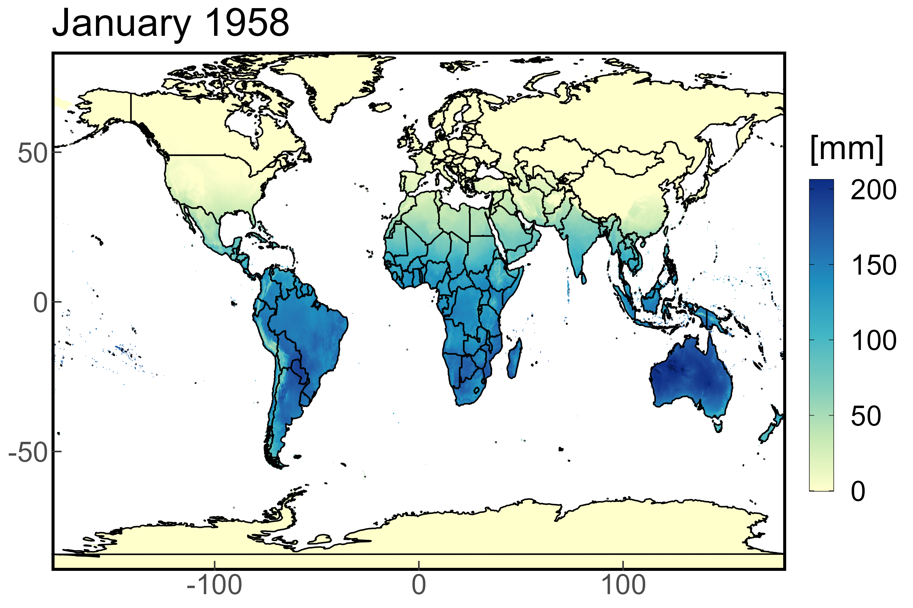
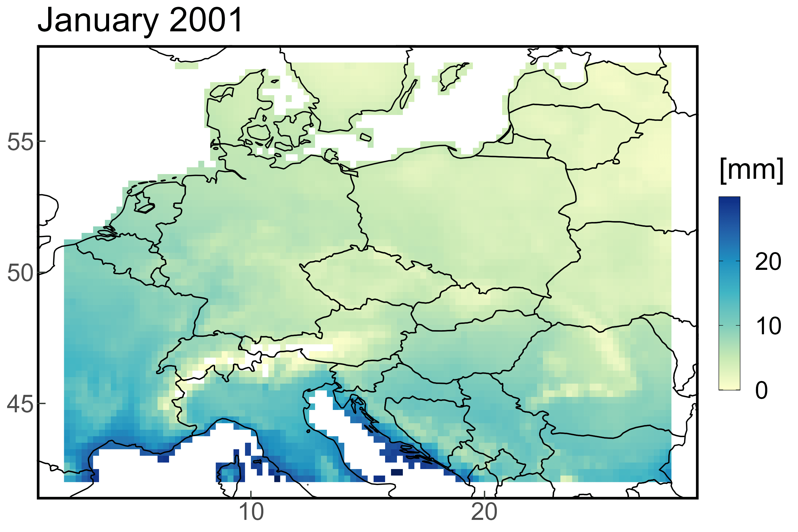
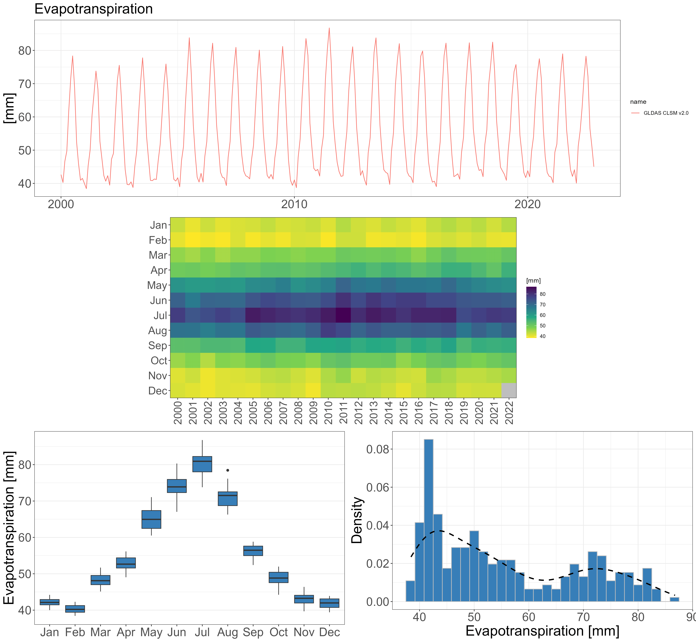
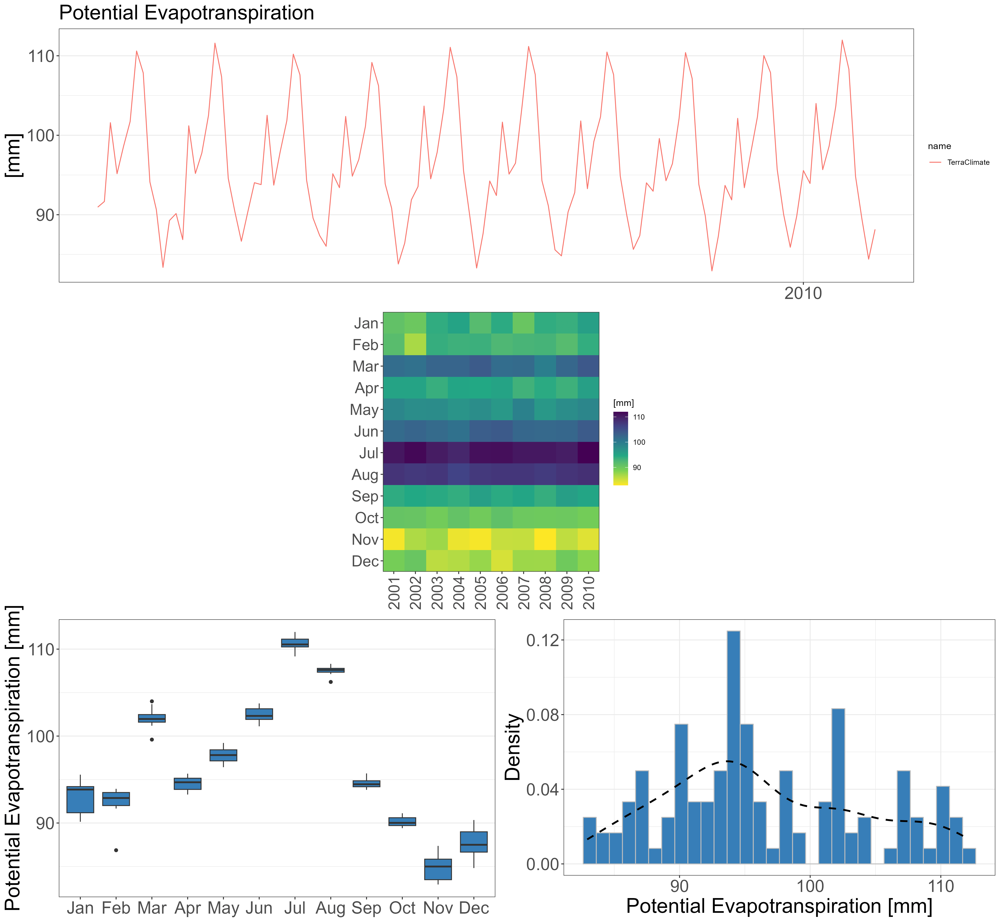

```{=html}
<style>
body {
text-align: justify}
</style>
```

------------------------------------------------------------------------

```{r start, include = FALSE}
knitr::opts_chunk$set(
  echo = TRUE,
  eval = TRUE,
  fig.width = 7,
  warning = FALSE,
  message = FALSE
)
library(evapoRe)
library(kableExtra)
data('gldas_clsm_global_ts')
data('gldas_clsm_subset_ts')
data('gldas_clsm_esp_ts')
data('pet_oudin_global_ts')
data('pet_oudin_subset_ts')
data('pet_oudin_cz_ts')
```

The `evapoRe` package developed as a complementary toolbox to the
pRecipe package [@vargas-godoy2023precipitation], available at
[<https://cran.r-project.org/web/packages/pRecipe/index.html>].
`evapoRe` facilitates the download, exploration, visualization, and
analysis of evapotranspiration (ET) data. Additionally, evapoRe offers
the functionality to calculate various Potential EvapoTranspiration
(PET) methods.

------------------------------------------------------------------------

## Before We Start

Like many other R packages, `evapoRe` has some system requirements:

-   [PROJ](https://proj.org/download.html)
-   Geospatial Data Abstraction Library
    [(GDAL)](https://gdal.org/download.html)
-   Network Common Data Form
    [(NetCDF)](https://www.unidata.ucar.edu/software/netcdf/)

## Data

`evapoRe` database hosts 10 different ET data sets; one satellite-based,
four reanalysis, and five hydrological model products. Their native
specifications, as well as links to their providers, and their
respective references are detailed in the following subsections. We have
already homogenized, compacted to a single file, and stored them in a
[Zenodo repository](https://doi.org/10.5281/zenodo.7990413) under the
following naming convention:

`<data set>_<variable>_<units>_<coverage>_<start date>_<end date>_<resolution>_<time step>.nc`

The `evapoRe` data collection was homogenized to these specifications:

-   `<variable>` = evapotranspiration (e)
-   `<units>` = millimeters (mm)
-   `<resolution>` = 0.25°

E.g., ERA5 [@hersbach_era5_2020] would be:

`era5_e_mm_global_195901_202112_025_monthly.nc`

### Satellite-Based Products

```{r satellite, echo=FALSE, results = 'asis'}
tibble::tribble(
  ~"Data Set", ~"Spatial Resolution", ~Global, ~Land, ~Ocean, ~"Temporal Resolution", ~"Record Length", ~"Get Data", ~Reference, 
"GLEAM V3.0", "0.25°", "", "x", "", "Monthly", "1980/01-2021/12", "[Download](https://www.gleam.eu/)", "@martens_gleam_2017"
) |>
  kbl(align = 'lcccccccr') |>
  kable_styling("striped") |>
  add_header_above(c(" " = 1, " " = 1, "Spatial Coverage" = 3, " " = 1, " " = 1, " " = 1, " " = 1)) |>
  unclass() |> cat()
```

### Reanalysis Products

```{r reanalysis, echo=FALSE, echo=FALSE, results = 'asis'}
tibble::tribble(
  ~"Data Set", ~"Spatial Resolution", ~Global, ~Land, ~Ocean, ~"Temporal Resolution", ~"Record Length", ~"Get Data", ~Reference,
"ERA5-Land", "0.1°", "", "x", "", "Monthly", "1960/01-2022/12", "[Download](https://cds.climate.copernicus.eu/cdsapp#!/dataset/reanalysis-era5-land-monthly-means?tab=form)", "@munoz-sabater_era5-land_2021",
"ERA5", "0.25°", "x", "x", "x", "Monthly", "1959/01-2021/12", "[Download](https://cds.climate.copernicus.eu/cdsapp#!/dataset/reanalysis-era5-single-levels-monthly-means?tab=overview)", "@hersbach_era5_2020",
"JRA-55", "1.25°", "", "x", "", "Monthly", "1958/01-2021/12", "[Download](https://rda.ucar.edu/datasets/ds628.1/dataaccess/)", "@kobayashi_jra-55_2015",
"MERRA-2", "0.5° x 0.625°", "", "x", "", "Monthly", "1980/01-2023/01", "[Download](https://disc.gsfc.nasa.gov/datasets?page=1&project=MERRA-2)", "@gelaro_modern-era_2017"
) |>
  kbl(align = 'lcccccccr') |>
  kable_styling("striped") |>
  add_header_above(c(" " = 1, " " = 1, "Spatial Coverage" = 3, " " = 1, " " = 1, " " = 1, " " = 1)) |>
  unclass() |> cat()
```

### Hydrological Models

```{r models, echo=FALSE, results = 'asis'}
tibble::tribble(
  ~"Data Set", ~"Spatial Resolution", ~Global, ~Land, ~Ocean, ~"Temporal Resolution", ~"Record Length", ~"Get Data", ~Reference,
"FLDAS", "0.1°", "", "x", "", "Monthly", "1982/01-2022/12", "[Download](https://ldas.gsfc.nasa.gov/fldas/fldas-data-download)", "@mcnally_land_2017",
"GLDAS CLSM V2.1", "1°", "", "x", "", "Monthly", "2000/01-2022/11", "[Download](https://ldas.gsfc.nasa.gov/gldas/gldas-get-data)", "@rodell_global_2004",
"GLDAS NOAH V2.1", "0.25°", "", "x", "", "Monthly", "2000/01-2022/11", "[Download](https://ldas.gsfc.nasa.gov/gldas/gldas-get-data)", "@rodell_global_2004 and @beaudoing_gldas_2020",
"GLDAS VIC V2.1", "1°", "", "x", "", "Monthly", "2000/01-2022/11", "[Download](https://ldas.gsfc.nasa.gov/gldas/gldas-get-data)", "@rodell_global_2004",
"TerraClimate", "4$km$", "", "x", "", "Monthly", "1958/01-2021/12", "[Download](https://www.climatologylab.org/terraclimate.html)", "@abatzoglou_terraclimate_2018"
) |>
  kbl(align = 'lcccccccr') |>
  kable_styling("striped") |>
  add_header_above(c(" " = 1, " " = 1, "Spatial Coverage" = 3, " " = 1, " " = 1, " " = 1, " " = 1)) |>
  unclass() |> cat()
```

# Demo

In this introductory demo we will first download the GLDAS-CLSM data
set. We will then subset the downloaded data over Mediterranean region
for the 2001-2010 period, and crop it to the national scale for Spain.
In paralel, we will estimate potential evapotranspiration over the same
domain and the same record length. In the next step, we will generate
time series for our data sets and conclude with the visualization of our
data.

## Installation

```{r evapoRe_installation, eval = FALSE}
devtools::install_github("AkbarR1184/evapoRe") #latest dev version
install.packages('evapoRe')                    #latest CRAN release
library(evapoRe)
```

## Download

Downloading the entire data collection or only a few data sets is quite
straightforward. You just call the `download_data` function, which has
four arguments *data_name*, *path*, *domain*, and *time_res*.

-   *data_name* is set to "all" by default, but you can specify the
    names of your data sets of interest only.
-   *path* is set to "." by default. I.e., the current working
    directory. By replacing it for [your_project_folder], the downloaded
    files will be stored in [your_project_folder] instead.
-   *domain* is set to "raw" by default, but you can specify the domain
    of your interest only. E.g., "ocean" for ocean only data sets (For
    availability please check the [Data] section).
-   *time_res* is set to "monthly" by default, but if you prefer you can
    also download annual data with "yearly".

Let's download the GLDAS CLSM data set and inspect its content with
`infoNC`:

```{r download, eval = FALSE}
download_data(data_name = 'gldas-clsm')
gldas_clsm_global <- raster::brick('gldas-clsm_e_mm_land_200001_202211_025_monthly.nc')
infoNC(gldas_clsm_global)
```

```         
[1] "class      : RasterBrick "                                         
[2] "dimensions : 720, 1440, 1036800, 275  (nrow, ncol, ncell, nlayers)"
[3] "resolution : 0.25, 0.25  (x, y)"
[4] "extent     : -180, 180, -90, 90  (xmin, xmax, ymin, ymax)"
[5] "crs        : +proj=longlat +datum=WGS84 "
[6] "source     : gldas-clsm_e_mm_land_200001_202211_025_monthly.nc "
[7] "names      : X2000.01.01, X2000.02.01, X2000.03.01, X2000.04.01, X2000.05.01, X2000.06.01, X2000.07.01, X2000.08.01, X2000.09.01, X2000.10.01, X2000.11.01, X2000.12.01, X2001.01.01, X2001.02.01, X2001.03.01, ... "
[8] "Date       : 2000-01-01, 2022-11-01 (min, max)"
[9] "varname    : e " 
```

## Processing

Once we have downloaded our database, we can start processing the data
with:

-   `crop_data` to crop the data using a shapefile.
-   `fldmean` to generate a time series by taking the area weighted
    average over each timestep.
-   `remap` to go from the native resolution (0.25°) to coarser ones
    (e.g., 0.5°, 1°, 1.5°, ...).
-   `subset_data` to subset the data in time and/or space.
-   `yearstat` to aggregate the data from monthly into annual.

### Subset

To subset our data to a desired region and period of interest, we use
the `subset_data` function, which has three arguments *x*, *box*, and
*yrs*.

-   *x* Raster\* object or a data.table or a filename (character).
-   *box* is the bounding box of the region of interest with the
    coordinates in degrees in the form (xmin, xmax, ymin, ymax).
-   *yrs* is the period of interest with years in the form (start_year,
    end_year).

Let's subset the GLDAS CLSM data set over Mediterranean region
(-10,40,30,45) for the 2001-2010 period, and inspect its content with
`infoNC`:

```{r gldas-clsm_subset, eval = FALSE}
gldas_clsm_subset <- subset_data(gldas_clsm_global,box = c(-10,40,30,45) ,yrs = c(2001, 2010))
infoNC(gldas_clsm_subset)
```

```         
[1] "class      : RasterBrick "
[2] "dimensions : 60, 200, 12000, 120  (nrow, ncol, ncell, nlayers)" 
[3] "resolution : 0.25, 0.25  (x, y)"
[4] "extent     : -10, 40, 30, 45  (xmin, xmax, ymin, ymax)"
[5] "crs        : +proj=longlat +datum=WGS84 +no_defs "
[6] "source     : memory"
[7] "names      :  X2001.01.01,  X2001.02.01,  X2001.03.01,  X2001.04.01,  X2001.05.01,  X2001.06.01,  X2001.07.01,  X2001.08.01,  X2001.09.01,  X2001.10.01,  X2001.11.01,  X2001.12.01,  X2002.01.01,  X2002.02.01,  X2002.03.01, ... "
[8] "min values :  0.85979986,  1.62062681,  1.42477119,  0.76781327,  0.75662607,  0.34450921,  0.25072542,  0.15768366,  0.13057871,  0.05979802,  0.11780920, -0.69875073,  0.36552662,  0.70131457,  0.63548779, ... "
[9] "max values :    80.61240,    89.56071,   101.81876,   143.45859,   158.37830,   202.83186,   192.55907,   190.07066,   111.40405,   116.93645,    67.32398,    48.42713,    74.23843,    59.85103,    88.96181, ... "
[10] "time       : 2001-01-01, 2010-12-01 (min, max)"
```

### Crop

To further crop our data to a desired polygon other than a rectangle, we
use the `crop_data` function, which has two arguments *x*, and *y*.

-   *x* Raster\* object or a data.table or a \*.nc filename (character).
-   *y* is a ".shp" filename (character).

Let's crop our GLDAS CLSM subset to cover only Spain with the respective
[shape
file](https://geodata.ucdavis.edu/gadm/gadm4.1/shp/gadm41_ESP_shp.zip),
and inspect its content with `infoNC`:

```{r gldas-clsm_crop, eval = FALSE}
gldas_clsm_esp <- crop_data(gldas_clsm_subset, "gadm41_ESP_0.shp")
infoNC(gldas_clsm_esp)
```

```         
[1] "class      : RasterBrick "
[2] "dimensions : 56, 58, 3248, 120  (nrow, ncol, ncell, nlayers)"
[3] "resolution : 0.25, 0.25  (x, y)"
[4] "extent     : -10, 4.5, 30, 44  (xmin, xmax, ymin, ymax)"
[5] "crs        : +proj=longlat +datum=WGS84 +no_defs " 
[6] "source     : memory"
[7] "names      : X2001.01.01, X2001.02.01, X2001.03.01, X2001.04.01, X2001.05.01, X2001.06.01, X2001.07.01, X2001.08.01, X2001.09.01, X2001.10.01, X2001.11.01, X2001.12.01, X2002.01.01, X2002.02.01, X2002.03.01, ... "
[8] "min values :   7.216680,   18.606867,   32.398956,   37.939827,   39.484840,   29.796391,   15.073787,   17.676109,   15.789503,   26.564753,   13.147447,    9.846310,    8.794820,   14.355796,   26.288857, ... "
[9] "max values :    80.61240,    89.56071,   101.81876,   139.86717,   151.03282,   197.47284,   146.44232,   145.36212,   111.40405,   116.93645,    67.32398,    48.42713,    74.23843,    58.79382,    88.13857, ... "
[10] "time       : 2001-01-01, 2010-12-01 (min, max)" 
```

### PET calculation

First we need to download temperature data, available at: [Zenodo
repository](https://doi.org/10.5281/zenodo.10009796):

**NOTE:** Temperature data available at the moment is limited to monthly. The data sets are TerraClimate, MSWX, and CRU and for brevity We will only
estimate PET over the 2001 to 2010 period using MSWX dataset.

we use the `download_t_data` function, which has five arguments
*dataset*, *variable*, *path*, *time_res*, and *domain*.

-   *dataset* is the dataset name you can specify the names of your data sets of interest only.
-   *variable* is the variable name in which `t2m`,`tmin`, and `tmax` stand for average temperature, minimum temperature, and maximum temperature.
-   *path* is set to "." by default. I.e., the current working
    directory.
-   *domain* is set to "raw" by default, but you can specify the domain
    of your interest only. E.g., "ocean" for ocean only data sets (For
    availability please check the [Data] section).
-   *time_res* is set to "monthly" by default, but if you prefer you can
    also download annual data with "yearly".

```{r download_mswx, eval=FALSE}
download_t_data(dataset="mswx", variable = "t2m", path = ".", domain = "global")
```

This will download temperature data in following naming convention e.g.,

`mswx_t2m_degC_global_197901_202308_025_monthly.nc`

As stated above we will work only with the 2001-2010 period. Since
`evapoRe` makes all of `pRecipe` functions available we can load and
subset the data as follows:

```{r subset_mswx, eval=FALSE}
t2m_global <- raster::brick("mswx_t2m_degC_global_197901_202308_025_monthly.nc") %>% subset_data(yrs = c(2001, 2010))
infoNC(t2m_global)
```

```         
[1] "class      : RasterBrick "
[2] "dimensions : 720, 1440, 1036800, 120  (nrow, ncol, ncell, nlayers)"
[3] "resolution : 0.25, 0.25  (x, y)" 
[4] "extent     : -180, 180, -90, 90  (xmin, xmax, ymin, ymax)"
[5] "crs        : +proj=longlat +datum=WGS84 +no_defs "
[6] "source     : memory"
[7] "names      : X2001.01.01, X2001.02.01, X2001.03.01, X2001.04.01, X2001.05.01, X2001.06.01, X2001.07.01, X2001.08.01, X2001.09.01, X2001.10.01, X2001.11.01, X2001.12.01, X2002.01.01, X2002.02.01, X2002.03.01, ... "
[8] "min values :   -49.86768,   -45.24437,   -56.82771,   -61.03486,   -61.46924,   -63.51792,   -65.22484,   -68.83775,   -62.22537,   -57.00378,   -42.79177,   -44.69320,   -46.77869,   -47.19707,   -56.07567, ... "
[9] "max values :    35.00875,    33.52000,    33.29000,    35.04688,    38.26308,    39.35505,    40.33314,    39.98806,    36.99562,    33.00374,    32.52186,    33.59248,    34.46944,    33.25062,    33.71313, ... "
[10] "time       : 2001-01-01, 2010-12-01 (min, max)" 
```

The `pet` function estimates PET using a method of choice from the
following available options:

-   *bc* for Blaney and Criddle [@blaney1952determining].
-   *ha* for Hamon [@hamon1961estimating]
-   *jh* for Jensen and Haise [@jensen1963estimating]
-   *mb* for McGuinness and Bordne [@mcguinness1972comparison]
-   *od* for Oudin [@oudin2005potential]
-   *th* for Thornthwaite [@thornthwaite1948approach]

The `pet` function has two arguments *x* and *method*.

-   *x* is a RasterBrick object with average temperature data.
-   *method* a character string indicating the method to be used.

Let's calculate PET using the Oudin formulation. Then, same as GLDAS
CLSM we can subset it over Mediterranean region and Spain, and inspect
its content with `infoNC`:

**NOTE:** `pet` output is [mm/day], in order to get values in [mm] for a
1 to 1 comparison we use `muldpm` function.

```{r pet, eval=FALSE}
pet_oudin_global <- pet(t2m_global, method = "od") %>% muldpm
infoNC(pet_oudin_global)
```

```         
[1] "class      : RasterBrick "
[2] "dimensions : 720, 1440, 1036800, 120  (nrow, ncol, ncell, nlayers)" 
[3] "resolution : 0.25, 0.25  (x, y)"
[4] "extent     : -180, 180, -90, 90  (xmin, xmax, ymin, ymax)"
[5] "crs        : +proj=longlat +datum=WGS84 +no_defs "
[6] "source     : memory"
[7] "names      :    layer.1,    layer.2,    layer.3,    layer.4,    layer.5,    layer.6,    layer.7,    layer.8,    layer.9,   layer.10,   layer.11,   layer.12,   layer.13,   layer.14,   layer.15, ... "
[8] "min values :        0,        0,        0,        0,        0,        0,        0,        0,        0,        0,        0,        0,        0,        0,        0, ... "
[9] "max values : 219.5310, 176.8754, 184.4747, 189.0052, 222.4694, 224.2932, 233.6676, 220.5922, 187.6766, 182.0405, 189.9230, 206.4958, 214.1489, 176.4865, 184.7495, ... "
[10] "time       : 2001-01-01, 2010-12-01 (min, max)"
```

```{r pet_oudin_subset, eval = FALSE}
pet_oudin_subset <- subset_data(pet_oudin_global, box = c(-10,40,30,45))
infoNC(pet_oudin_subset)
```

```         
[1] "class      : RasterBrick "
[2] "dimensions : 64, 104, 6656, 120  (nrow, ncol, ncell, nlayers)"
[3] "resolution : 0.25, 0.25  (x, y)"
[4] "extent     : -10, 40, 30, 45  (xmin, xmax, ymin, ymax)"
[5] "crs        : +proj=longlat +datum=WGS84 +no_defs "
[6] "source     : memory"
[7] "names      :     layer.1,     layer.2,     layer.3,     layer.4,     layer.5,     layer.6,     layer.7,     layer.8,     layer.9,    layer.10,    layer.11,    layer.12,    layer.13,    layer.14,    layer.15, ... "
[8] "min values :  0.099306993,  0.740073621, 13.313356400, 11.852478027, 47.733558655, 62.935859680, 79.710861206, 77.624824524, 33.284637451, 28.931745529,  4.929368973,  0.039311446,  0.030302685,  2.928590298,  8.578594208, ... "
[9] "max values :     57.49900,     63.00223,    115.40463,    131.55266,    177.77098,    204.70670,    222.70251,    200.23511,    165.45422,    117.08133,     69.63583,     57.67846,     60.12381,     65.31674,    103.43404, ... "
[10] "time       : 2001-01-01, 2010-12-01 (min, max)"
```

```{r pet_oudin_crop, eval = FALSE}
pet_oudin_esp <- crop_data(pet_oudin_subset, "gadm41_ESP_0.shp")
infoNC(pet_oudin_esp)
```

```         
[1] "class      : RasterBrick " 
[2] "dimensions : 56, 58, 3248, 120  (nrow, ncol, ncell, nlayers)"  
[3] "resolution : 0.25, 0.25  (x, y)"
[4] "extent     : -10, 4.5, 30, 44  (xmin, xmax, ymin, ymax)"
[5] "crs        : +proj=longlat +datum=WGS84 +no_defs "
[6] "source     : memory"  
[7] "names      :      layer.1,      layer.2,      layer.3,      layer.4,      layer.5,      layer.6,      layer.7,      layer.8,      layer.9,     layer.10,     layer.11,     layer.12,     layer.13,     layer.14,     layer.15, ... "
[8] "min values :   3.5873966,   3.6652386,  23.3621693,  26.7197380,  54.5738144,  83.2696991,  93.0016861,  91.4133835,  49.0935822,  34.9640312,   5.8351221,   0.5116812,   4.7784176,   7.1974645,  19.2179432, ... "
[9] "max values :    40.66180,    48.18053,    80.11776,   100.17784,   125.64010,   160.57205,   165.80086,   155.79111,   111.13911,    80.95558,    44.86891,    37.12437,    40.82948,    48.49249,    74.67580, ... "
[10] "time       : 2001-01-01, 2010-12-01 (min, max)"
```

### Generate Time series

#### Time series for global ET products

To make a time series out of our data, we use the `fldmean` function,
which has one argument *x*.

-   *x* Raster\* object or a data.table or a \*.nc filename (character).

Let's generate the time series for our three different GLDAS CLSM data
sets (Global, Mediterranean region, and Spain), and inspect its first 12
rows:

```{r gldas_clsm_global_ts, eval=FALSE}
gldas_clsm_global_ts <- fldmean(gldas_clsm_global)
head(gldas_clsm_global_ts, 12)
```

```         
      date    value            name          type
 1: 2000-01-01 42.63418 GLDAS CLSM v2.0 Model forcing
 2: 2000-02-01 40.28064 GLDAS CLSM v2.0 Model forcing
 3: 2000-03-01 46.65724 GLDAS CLSM v2.0 Model forcing
 4: 2000-04-01 49.73078 GLDAS CLSM v2.0 Model forcing
 5: 2000-05-01 61.78450 GLDAS CLSM v2.0 Model forcing
 6: 2000-06-01 71.51643 GLDAS CLSM v2.0 Model forcing
 7: 2000-07-01 78.34947 GLDAS CLSM v2.0 Model forcing
 8: 2000-08-01 68.59857 GLDAS CLSM v2.0 Model forcing
 9: 2000-09-01 52.40877 GLDAS CLSM v2.0 Model forcing
10: 2000-10-01 45.95624 GLDAS CLSM v2.0 Model forcing
11: 2000-11-01 40.95821 GLDAS CLSM v2.0 Model forcing
12: 2000-12-01 41.50710 GLDAS CLSM v2.0 Model forcing
```

```{r gldas_clsm_subset_ts, eval=FALSE}
gldas_clsm_subset_ts <- fldmean(gldas_clsm_subset)
head(gldas_clsm_subset_ts, 12)
```

```         
     date      value            name          type
 1: 2001-01-01   6.684203 GLDAS CLSM v2.0 Model forcing
 2: 2001-02-01  15.447494 GLDAS CLSM v2.0 Model forcing
 3: 2001-03-01  26.575641 GLDAS CLSM v2.0 Model forcing
 4: 2001-04-01  53.388876 GLDAS CLSM v2.0 Model forcing
 5: 2001-05-01 111.508691 GLDAS CLSM v2.0 Model forcing
 6: 2001-06-01 103.385836 GLDAS CLSM v2.0 Model forcing
 7: 2001-07-01 119.376406 GLDAS CLSM v2.0 Model forcing
 8: 2001-08-01 108.626158 GLDAS CLSM v2.0 Model forcing
 9: 2001-09-01  45.849332 GLDAS CLSM v2.0 Model forcing
10: 2001-10-01  32.508406 GLDAS CLSM v2.0 Model forcing
11: 2001-11-01  15.332365 GLDAS CLSM v2.0 Model forcing
12: 2001-12-01   9.997737 GLDAS CLSM v2.0 Model forcing
```

```{r gldas_clsm_esp_ts, eval=FALSE}
gldas_clsm_esp_ts <- fldmean(gldas_clsm_esp)
head(gldas_clsm_esp_ts, 12)
```

```         
         date      value            name          type
 1: 2001-01-01   1.843749 GLDAS CLSM v2.0 Model forcing
 2: 2001-02-01  11.758140 GLDAS CLSM v2.0 Model forcing
 3: 2001-03-01  17.860222 GLDAS CLSM v2.0 Model forcing
 4: 2001-04-01  48.019425 GLDAS CLSM v2.0 Model forcing
 5: 2001-05-01 114.183978 GLDAS CLSM v2.0 Model forcing
 6: 2001-06-01  82.153565 GLDAS CLSM v2.0 Model forcing
 7: 2001-07-01 108.249534 GLDAS CLSM v2.0 Model forcing
 8: 2001-08-01 109.140553 GLDAS CLSM v2.0 Model forcing
 9: 2001-09-01  33.501152 GLDAS CLSM v2.0 Model forcing
10: 2001-10-01  27.275303 GLDAS CLSM v2.0 Model forcing
11: 2001-11-01   8.356745 GLDAS CLSM v2.0 Model forcing
12: 2001-12-01   6.125528 GLDAS CLSM v2.0 Model forcing
```

#### Time series for calculated PET

Let's generate the time series for our three different PET calculated by
Oudin method (Global, Mediterranean region, and Spain), and inspect its
first 12 rows:

```{r pet_oudin_global_ts, eval=FALSE}
pet_oudin_global_ts <- fldmean(pet_oudin_global)
head(pet_oudin_global_ts, 12)
```

```         
        date     value         name          type
 1: 2001-01-01  90.95112 TerraClimate Model forcing
 2: 2001-02-01  91.66514 TerraClimate Model forcing
 3: 2001-03-01 101.58235 TerraClimate Model forcing
 4: 2001-04-01  95.16555 TerraClimate Model forcing
 5: 2001-05-01  98.58120 TerraClimate Model forcing
 6: 2001-06-01 101.73452 TerraClimate Model forcing
 7: 2001-07-01 110.60216 TerraClimate Model forcing
 8: 2001-08-01 107.84045 TerraClimate Model forcing
 9: 2001-09-01  94.12793 TerraClimate Model forcing
10: 2001-10-01  90.64953 TerraClimate Model forcing
11: 2001-11-01  83.37564 TerraClimate Model forcing
12: 2001-12-01  89.26847 TerraClimate Model forcing
```

```{r pet_oudin_subset_ts, eval=FALSE}
pet_oudin_subset_ts <- fldmean(pet_oudin_subset)
head(pet_oudin_subset_ts, 12)
```

```         
         date      value         name          type
 1: 2001-01-01   7.620077 TerraClimate Model forcing
 2: 2001-02-01  11.655452 TerraClimate Model forcing
 3: 2001-03-01  29.309794 TerraClimate Model forcing
 4: 2001-04-01  50.257311 TerraClimate Model forcing
 5: 2001-05-01  93.835662 TerraClimate Model forcing
 6: 2001-06-01 103.771513 TerraClimate Model forcing
 7: 2001-07-01 125.393676 TerraClimate Model forcing
 8: 2001-08-01 106.738780 TerraClimate Model forcing
 9: 2001-09-01  56.908180 TerraClimate Model forcing
10: 2001-10-01  37.982284 TerraClimate Model forcing
11: 2001-11-01  11.427742 TerraClimate Model forcing
12: 2001-12-01   4.599400 TerraClimate Model forcing
```

```{r pet_odin_esp_ts, eval=FALSE}
pet_oudin_esp_ts <- fldmean(pet_oudin_esp)
head(pet_oudin_esp_ts, 12)
```

```         
         date      value         name          type
 1: 2001-01-01   4.088036 TerraClimate Model forcing
 2: 2001-02-01   8.909776 TerraClimate Model forcing
 3: 2001-03-01  24.280493 TerraClimate Model forcing
 4: 2001-04-01  44.816892 TerraClimate Model forcing
 5: 2001-05-01  92.737708 TerraClimate Model forcing
 6: 2001-06-01  96.017031 TerraClimate Model forcing
 7: 2001-07-01 115.609065 TerraClimate Model forcing
 8: 2001-08-01 100.815075 TerraClimate Model forcing
 9: 2001-09-01  50.340782 TerraClimate Model forcing
10: 2001-10-01  35.079328 TerraClimate Model forcing
11: 2001-11-01   8.630342 TerraClimate Model forcing
12: 2001-12-01   1.422131 TerraClimate Model forcing
```

## Visualize

Either after we have processed our data as required or right after
downloaded, we have six different options to visualize our data for more
information refer to [visualisation section of
pRecipe](https://cran.r-project.org/web/packages/pRecipe/vignettes/pRecipe.html#visualize):

### Maps

To see a map of any data set raw or processed, we use `plot_map` which
takes only one layer of the RasterBrick as input.

```{r map_global, eval = FALSE}
plot_map(gldas_clsm_global[[13]]) 
plot_map(pet_oudin_global[[1]]) 
```

{width="8.4cm" height="5cm"}
{width="8.4cm" height="5cm"}

```{r map_subset, eval = FALSE}
plot_map(gldas_clsm_subset[[1]])
plot_map(pet_oudin_subset[[1]])
```

{width="8.4cm" height="5cm"}
{width="8.4cm" height="5cm"}

```{r map_esp, eval = FALSE}
plot_map(gldas_clsm_esp[[1]])
plot_map(pet_oudin_esp[[1]])
```

{width="8.4cm"
height="5cm"}{width="8.4cm" height="5cm"}

### Time Series Visuals

To draw a time series generated by `fldmean`, we use any of the options
below, which takes only a `fldmean` ".csv" generated file.

#### Lineplots

```{r}

# Plotting globals
p01 <- plot_line(gldas_clsm_global_ts, var = "Evapotranspiration")
p02 <- plot_line(pet_oudin_global_ts, var = "Potential Evapotranspiration")
ggpubr::ggarrange(p01, p02, ncol = 1)
# Plotting subsets
p01 <- plot_line(gldas_clsm_subset_ts, var = "ET")
p02 <- plot_line(pet_oudin_subset_ts, var = "PET")
ggpubr::ggarrange(p01, p02, ncol = 2)
# Plotting esp
p01 <- plot_line(gldas_clsm_esp_ts, var = "ET")
p02 <- plot_line(pet_oudin_esp_ts, var = "PET")
ggpubr::ggarrange(p01, p02, ncol = 2)

```

#### Heatmap

```{r}

# Plotting globals
plot_heatmap(gldas_clsm_global_ts)
plot_heatmap(pet_oudin_global_ts)
# Plotting subsets
p01 <- plot_heatmap(gldas_clsm_subset_ts)
p02 <- plot_heatmap(pet_oudin_subset_ts)
ggpubr::ggarrange(p01, p02, ncol = 2, common.legend = TRUE, legend = "right")
# Plotting esp
p01 <- plot_heatmap(gldas_clsm_esp_ts)
p02 <- plot_heatmap(pet_oudin_esp_ts)
ggpubr::ggarrange(p01, p02, ncol = 2, common.legend = TRUE, legend = "right")

```

#### Boxplot

```{r}

# Plotting globals
p01 <- plot_box(gldas_clsm_global_ts, var = "ET")
p02 <- plot_box(pet_oudin_global_ts, var = "PET")
ggpubr::ggarrange(p01, p02, ncol = 2)
# Plotting subsets
p01 <- plot_box(gldas_clsm_subset_ts, var = "ET")
p02 <- plot_box(pet_oudin_subset_ts, var = "PET")
ggpubr::ggarrange(p01, p02, ncol = 2)
# Plotting esp
p01 <- plot_box(gldas_clsm_esp_ts, var = "ET" )
p02 <- plot_box(pet_oudin_esp_ts, var = "PET" )
ggpubr::ggarrange(p01, p02, ncol = 2)

```

#### Density plots

```{r}
# Plotting globals
p01 <- plot_density(gldas_clsm_global_ts, var = "ET")
p02 <- plot_density(pet_oudin_global_ts, var = "PET")
ggpubr::ggarrange(p01, p02, ncol = 2)
# Plotting subsets
p01 <- plot_density(gldas_clsm_subset_ts, var = "ET")
p02 <- plot_density(pet_oudin_subset_ts, var = "PET")
ggpubr::ggarrange(p01, p02, ncol = 2)
# Plotting esp
p01 <- plot_density(gldas_clsm_esp_ts, var = "ET")
p02 <- plot_density(pet_oudin_esp_ts, var = "PET")
ggpubr::ggarrange(p01, p02, ncol = 2)

```

#### Summary

**NOTE:** For good aesthetics we recommend saving `plot_summary` with
`ggsave(<filename>, <plot>, width = 16.3, height = 15.03)`.

```{r, eval=FALSE}
plot_summary(gldas_clsm_global_ts, var = "Evapotranspiration")
#plot_summary(gldas_clsm_subset_ts, var = "Evapotranspiration")
#plot_summary(gldas_clsm_esp_ts, var = "Evapotranspiration")

```

{width="95%"}

```{r, eval=FALSE}
plot_summary(pet_oudin_global_ts, var = "Potential Evapotranspiration")
#plot_summary(pet_oudin_subset_ts)
#plot_summary(pet_oudin_esp_ts)
```

{width="95%"}

# Coming Soon

We will introduce significant enhancements to ET database and PET
calculation methods. This expansion builds upon our existing
temperature-based approach and incorporates a radiation-based PET
calculation methods, along with an expanded range of temperature-based
methods. Our aim is to provide users with a more comprehensive and
accurate estimation of ET and PET, catering to a broader range of
applications and requirements.

# References
