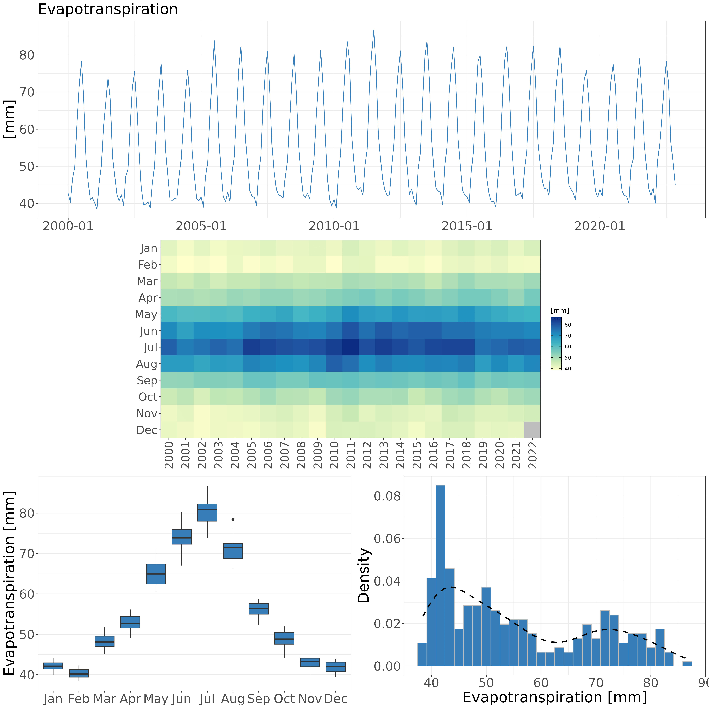

```{=html}
<style>
body {
text-align: justify}
</style>
```

------------------------------------------------------------------------

```{r start, include = FALSE}
knitr::opts_chunk$set(
  echo = TRUE,
  eval = TRUE,
  fig.width = 7,
  warning = FALSE,
  message = FALSE
)
library(evapoRe)
library(kableExtra)
data('gldas_clsm_global_ts')
data('gldas_clsm_subset_ts')
data('gldas_clsm_esp_ts')
data('pet_oudin_global_ts')
data('pet_oudin_subset_ts')
data('pet_oudin_esp_ts')
```

The `evapoRe` package developed as a complementary toolbox to the
pRecipe package [@vargas-godoy2023precipitation], available at
[<https://CRAN.R-project.org/package=pRecipe>]. `evapoRe` facilitates
the download, exploration, visualization, and analysis of
evapotranspiration (ET) data. Additionally, evapoRe offers the
functionality to calculate various Potential EvapoTranspiration (PET)
methods.

------------------------------------------------------------------------

## Before We Start

Like many other R packages, `evapoRe` has some system requirements:

-   [PROJ](https://proj.org/download.html)
-   Geospatial Data Abstraction Library
    [(GDAL)](https://gdal.org/en/stable/download.html)
-   Network Common Data Form
    [(NetCDF)](https://www.unidata.ucar.edu/software/netcdf/)

## Data

`evapoRe` database hosts 13 different ET data sets; three
satellite-based, five reanalysis, and five hydrological model products.
Their native specifications, as well as links to their providers, and
their respective references are detailed in the following subsections.
We have already homogenized, compacted to a single file, and stored them
in a [Zenodo repository](https://doi.org/10.5281/zenodo.10011192) under
the following naming convention:

`<data set>_<variable>_<units>_<coverage>_<start date>_<end date>_<resolution>_<time step>.nc`

The `evapoRe` data collection was homogenized to these specifications:

-   `<variable>` = evapotranspiration (e)
-   `<units>` = millimeters (mm)
-   `<resolution>` = 0.25°

E.g., ERA5 [@hersbach_era5_2020] would be:

`era5_e_mm_global_195901_202112_025_monthly.nc`

### Satellite-Based Products

```{r satellite, echo=FALSE, results = 'asis'}
tibble::tribble(
  ~"Data Set", ~"Spatial Resolution", ~Global, ~Land, ~Ocean, ~"Temporal Resolution", ~"Record Length", ~"Get Data", ~Reference, 
"GLEAM V3.7b", "0.25°", "", "x", "", "Monthly", "1980/01-2021/12", "[Download](https://www.gleam.eu/)", "@martens_gleam_2017",
"BESS V2.0", "0.05°", "", "x", "", "Monthly", "1982/01-2019/12", "[Download](https://www.environment.snu.ac.kr/bessv2)", "@li2023bessv2",
"ETMonitor", "1$km$", "", "x", "", "Daily", "2000/06-2019/12", "[Download](https://data.casearth.cn/en/sdo/detail/63291c7e08415d54af833fe5)", "@zheng2022ETMonitor"
) |>
  kbl(align = 'lcccccccr') |>
  kable_styling("striped") |>
  add_header_above(c(" " = 1, " " = 1, "Spatial Coverage" = 3, " " = 1, " " = 1, " " = 1, " " = 1)) |>
  unclass() |> cat()
```

### Reanalysis Products

```{r reanalysis, echo=FALSE, echo=FALSE, results = 'asis'}
tibble::tribble(
  ~"Data Set", ~"Spatial Resolution", ~Global, ~Land, ~Ocean, ~"Temporal Resolution", ~"Record Length", ~"Get Data", ~Reference,
"ERA5-Land", "0.1°", "", "x", "", "Monthly", "1960/01-2022/12", "[Download](https://cds.climate.copernicus.eu/datasets/reanalysis-era5-land-monthly-means?tab=overview)", "@munoz-sabater_era5-land_2021",
"ERA5", "0.25°", "", "x", "", "Monthly", "1959/01-2021/12", "[Download](https://cds.climate.copernicus.eu/datasets/reanalysis-era5-single-levels-monthly-means?tab=overview)", "@hersbach_era5_2020",
"JRA-55", "1.25°", "", "x", "", "Monthly", "1958/01-2021/12", "[Download](https://rda.ucar.edu/datasets/ds628.1/dataaccess/)", "@kobayashi_jra-55_2015",
"MERRA-2", "0.5° x 0.625°", "", "x", "", "Monthly", "1980/01-2023/01", "[Download](https://disc.gsfc.nasa.gov/datasets?page=1&project=MERRA-2)", "@gelaro_modern-era_2017",
"CAMELE", "0.25°", "", "x", "", "Monthly", "1980/01-2022/12", "[Download](https://zenodo.org/records/8047038)", "@li2023camele"
) |>
  kbl(align = 'lcccccccr') |>
  kable_styling("striped") |>
  add_header_above(c(" " = 1, " " = 1, "Spatial Coverage" = 3, " " = 1, " " = 1, " " = 1, " " = 1)) |>
  unclass() |> cat()
```

### Hydrological Models

```{r models, echo=FALSE, results = 'asis'}
tibble::tribble(
  ~"Data Set", ~"Spatial Resolution", ~Global, ~Land, ~Ocean, ~"Temporal Resolution", ~"Record Length", ~"Get Data", ~Reference,
"FLDAS", "0.1°", "", "x", "", "Monthly", "1982/01-2022/12", "[Download](https://ldas.gsfc.nasa.gov/fldas/fldas-data-download)", "@mcnally_land_2017",
"GLDAS CLSM V2.1", "1°", "", "x", "", "Monthly", "2000/01-2022/11", "[Download](https://ldas.gsfc.nasa.gov/gldas/gldas-get-data)", "@rodell_global_2004",
"GLDAS NOAH V2.1", "0.25°", "", "x", "", "Monthly", "2000/01-2022/11", "[Download](https://ldas.gsfc.nasa.gov/gldas/gldas-get-data)", "@rodell_global_2004 and @beaudoing_gldas_2020",
"GLDAS VIC V2.1", "1°", "", "x", "", "Monthly", "2000/01-2022/11", "[Download](https://ldas.gsfc.nasa.gov/gldas/gldas-get-data)", "@rodell_global_2004",
"TerraClimate", "4$km$", "", "x", "", "Monthly", "1958/01-2021/12", "[Download](https://www.climatologylab.org/terraclimate.html)", "@abatzoglou_terraclimate_2018"
) |>
  kbl(align = 'lcccccccr') |>
  kable_styling("striped") |>
  add_header_above(c(" " = 1, " " = 1, "Spatial Coverage" = 3, " " = 1, " " = 1, " " = 1, " " = 1)) |>
  unclass() |> cat()
```

# Demo

In this introductory demo we will first download the GLDAS-CLSM data
set. We will then subset the downloaded data over Mediterranean region
for the 2001-2010 period, and crop it to the national scale for Spain.
In paralel, we will estimate potential evapotranspiration over the same
domain and the same record length. In the next step, we will generate
time series for our data sets and conclude with the visualization of our
data.

## Installation

```{r evapoRe_installation, eval = FALSE}
devtools::install_github("AkbarR1184/evapoRe") #latest dev version
install.packages('evapoRe')                    #latest CRAN release
library(evapoRe)
```

## Download

Downloading the entire data collection or only a few data sets is quite
straightforward. You just call the `download_data` function, which has
four arguments *data_name*, *path*, *domain*, and *time_res*.

-   *data_name* is set to "all" by default, but you can specify the
    names of your data sets of interest only.
-   *path* can be set to ".". I.e., the current working directory. By
    replacing it for [your_project_folder], the downloaded files will be
    stored in [your_project_folder] instead.
-   *domain* is set to "raw" by default, but you can specify the domain
    of your interest only. E.g., "ocean" for ocean only data sets (For
    availability please check the [Data] section).
-   *time_res* is set to "monthly" by default, but if you prefer you can
    also download annual data with "yearly".

Let's download the GLDAS CLSM data set and inspect its content with
`infoNC`:

```{r download, eval = FALSE}
download_data(data_name = 'gldas-clsm', path = ".")
gldas_clsm_global <- raster::brick('gldas-clsm_e_mm_land_200001_202211_025_monthly.nc')
infoNC(gldas_clsm_global)
```

```         
[1] "class      : RasterBrick "                                         
[2] "dimensions : 720, 1440, 1036800, 275  (nrow, ncol, ncell, nlayers)"
[3] "resolution : 0.25, 0.25  (x, y)"
[4] "extent     : -180, 180, -90, 90  (xmin, xmax, ymin, ymax)"
[5] "crs        : +proj=longlat +datum=WGS84 "
[6] "source     : gldas-clsm_e_mm_land_200001_202211_025_monthly.nc "
[7] "names      : X2000.01.01, X2000.02.01, X2000.03.01, X2000.04.01, X2000.05.01, X2000.06.01, X2000.07.01, X2000.08.01, X2000.09.01, X2000.10.01, X2000.11.01, X2000.12.01, X2001.01.01, X2001.02.01, X2001.03.01, ... "
[8] "Date       : 2000-01-01, 2022-11-01 (min, max)"
[9] "varname    : e " 
```

## Processing

Once we have downloaded our database, we can start processing the data
with:

-   `crop_data` to crop the data using a shapefile.
-   `fldmean` to generate a time series by taking the area weighted
    average over each timestep.
-   `remap` to go from the native resolution (0.25°) to coarser ones
    (e.g., 0.5°, 1°, 1.5°, ...).
-   `subset_data` to subset the data in time and/or space.
-   `yearstat` to aggregate the data from monthly into annual.

### Subset

To subset our data to a desired region and period of interest, we use
the `subset_data` function, which has three arguments *x*, *box*, and
*yrs*.

-   *x* Raster\* object or a data.table or a filename (character).
-   *box* is the bounding box of the region of interest with the
    coordinates in degrees in the form (xmin, xmax, ymin, ymax).
-   *yrs* is the period of interest with years in the form (start_year,
    end_year).

Let's subset the GLDAS CLSM data set over Mediterranean region
(-10,40,30,45) for the 2001-2010 period, and inspect its content with
`infoNC`:

```{r gldas-clsm_subset, eval = FALSE}
gldas_clsm_subset <- subset_data(gldas_clsm_global,box = c(-10,40,30,45) ,yrs = c(2001, 2010))
infoNC(gldas_clsm_subset)
```

```         
[1] "class      : RasterBrick "
[2] "dimensions : 60, 200, 12000, 120  (nrow, ncol, ncell, nlayers)" 
[3] "resolution : 0.25, 0.25  (x, y)"
[4] "extent     : -10, 40, 30, 45  (xmin, xmax, ymin, ymax)"
[5] "crs        : +proj=longlat +datum=WGS84 +no_defs "
[6] "source     : memory"
[7] "names      :  X2001.01.01,  X2001.02.01,  X2001.03.01,  X2001.04.01,  X2001.05.01,  X2001.06.01,  X2001.07.01,  X2001.08.01,  X2001.09.01,  X2001.10.01,  X2001.11.01,  X2001.12.01,  X2002.01.01,  X2002.02.01,  X2002.03.01, ... "
[8] "min values :  0.85979986,  1.62062681,  1.42477119,  0.76781327,  0.75662607,  0.34450921,  0.25072542,  0.15768366,  0.13057871,  0.05979802,  0.11780920, -0.69875073,  0.36552662,  0.70131457,  0.63548779, ... "
[9] "max values :    80.61240,    89.56071,   101.81876,   143.45859,   158.37830,   202.83186,   192.55907,   190.07066,   111.40405,   116.93645,    67.32398,    48.42713,    74.23843,    59.85103,    88.96181, ... "
[10] "time       : 2001-01-01, 2010-12-01 (min, max)"
```

### Crop

To further crop our data to a desired polygon other than a rectangle, we
use the `crop_data` function, which has two arguments *x*, and *y*.

-   *x* Raster\* object or a data.table or a \*.nc filename (character).
-   *y* is a ".shp" filename (character).

Let's crop our GLDAS CLSM subset to cover only Spain with the respective
[shape
file](https://geodata.ucdavis.edu/gadm/gadm4.1/shp/gadm41_ESP_shp.zip),
and inspect its content with `infoNC`:

```{r gldas-clsm_crop, eval = FALSE}
gldas_clsm_esp <- crop_data(gldas_clsm_subset, "gadm41_ESP_0.shp")
infoNC(gldas_clsm_esp)
```

```         
[1] "class      : RasterBrick "
[2] "dimensions : 56, 58, 3248, 120  (nrow, ncol, ncell, nlayers)"
[3] "resolution : 0.25, 0.25  (x, y)"
[4] "extent     : -10, 4.5, 30, 44  (xmin, xmax, ymin, ymax)"
[5] "crs        : +proj=longlat +datum=WGS84 +no_defs " 
[6] "source     : memory"
[7] "names      : X2001.01.01, X2001.02.01, X2001.03.01, X2001.04.01, X2001.05.01, X2001.06.01, X2001.07.01, X2001.08.01, X2001.09.01, X2001.10.01, X2001.11.01, X2001.12.01, X2002.01.01, X2002.02.01, X2002.03.01, ... "
[8] "min values :   7.216680,   18.606867,   32.398956,   37.939827,   39.484840,   29.796391,   15.073787,   17.676109,   15.789503,   26.564753,   13.147447,    9.846310,    8.794820,   14.355796,   26.288857, ... "
[9] "max values :    80.61240,    89.56071,   101.81876,   139.86717,   151.03282,   197.47284,   146.44232,   145.36212,   111.40405,   116.93645,    67.32398,    48.42713,    74.23843,    58.79382,    88.13857, ... "
[10] "time       : 2001-01-01, 2010-12-01 (min, max)" 
```

### PET calculation

First we need to download temperature data, available at: [Zenodo
repository](https://doi.org/10.5281/zenodo.10019933):

**NOTE:** Temperature data available at the moment is limited to
monthly. The data sets are TerraClimate, MSWX, and CRU and for brevity
We will only estimate PET over the 2001 to 2010 period using MSWX
dataset.

we use the `download_t_data` function, which has five arguments
*data_name*, *variable*, *path*, *time_res*, and *domain*.

-   *data_name* is the dataset name you can specify the names of your
    data sets of interest.
-   *variable* is the variable name in which `t2m`,`tmin`, and `tmax`
    stand for average temperature, minimum temperature, and maximum
    temperature.
-   *path* can be set to ".". I.e., the current working directory. By
    replacing it for [your_project_folder], the downloaded files will be
    stored in [your_project_folder] instead.
-   *domain* is set to "raw" by default, but you can specify the domain
    of your interest only. E.g., "ocean" for ocean only data sets (For
    availability please check the [Data] section).
-   *time_res* is set to "monthly" by default, but if you prefer you can
    also download annual data with "yearly".

```{r download_mswx, eval=FALSE}
download_t_data(data_name ="mswx", variable = "t2m", path = ".")
```

This will download temperature data in following naming convention e.g.,

`mswx_t2m_degC_land_197901_202308_025_monthly.nc`

As stated above we will work only with the 2001-2010 period. Since
`evapoRe` makes all of `pRecipe` functions available we can load and
subset the data as follows:

```{r subset_mswx, eval=FALSE}
t2m_global <- raster::brick("mswx_t2m_degC_land_197901_202308_025_monthly.nc") %>% 
  subset_data(yrs = c(2001, 2010))
infoNC(t2m_global)
```

```         
[1] "class      : RasterBrick "
[2] "dimensions : 720, 1440, 1036800, 120  (nrow, ncol, ncell, nlayers)"
[3] "resolution : 0.25, 0.25  (x, y)" 
[4] "extent     : -180, 180, -90, 90  (xmin, xmax, ymin, ymax)"
[5] "crs        : +proj=longlat +datum=WGS84 +no_defs "
[6] "source     : memory"
[7] "names      : X2001.01.01, X2001.02.01, X2001.03.01, X2001.04.01, X2001.05.01, X2001.06.01, X2001.07.01, X2001.08.01, X2001.09.01, X2001.10.01, X2001.11.01, X2001.12.01, X2002.01.01, X2002.02.01, X2002.03.01, ... "
[8] "min values :  -49.867680,  -45.244373,  -42.529930,  -33.551258,  -22.829224,  -15.122508,  -13.402536,  -14.673846,  -18.428692,  -27.443539,  -35.674980,  -44.693199,  -46.778694,  -47.197075,  -42.277370, ... "
[9] "max values :    35.00875,    33.52000,    33.29000,    35.04688,    38.26308,    39.35505,    40.33314,    39.98806,    36.99562,    33.00374,    32.52186,    33.59248,    34.46944,    33.25062,    33.71313, ... "
[10] "time       : 2001-01-01, 2010-12-01 (min, max)" 
```

The `pet` function estimates PET using a method of choice from the
following available options:

-   *bc* for Blaney and Criddle [@blaney1952determining].
-   *ha* for Hamon [@hamon1961estimating]
-   *jh* for Jensen and Haise [@jensen1963estimating]
-   *mb* for McGuinness and Bordne [@mcguinness1972comparison]
-   *od* for Oudin [@oudin2005potential]
-   *th* for Thornthwaite [@thornthwaite1948approach]

The `pet` function has two arguments *x* and *method*.

-   *x* is a RasterBrick object with average temperature data.
-   *method* a character string indicating the method to be used.

Let's calculate PET using the Oudin formulation. Then, same as GLDAS
CLSM we can subset it over Mediterranean region and Spain, and inspect
its content with `infoNC`:

**NOTE:** `pet` output is [mm/day], in order to get values in [mm] for a
1 to 1 comparison we use `muldpm` function.

```{r pet, eval=FALSE}
pet_oudin_global <- pet(t2m_global, method = "od") %>% muldpm
infoNC(pet_oudin_global)
```

```         
[1] "class      : RasterBrick "
[2] "dimensions : 720, 1440, 1036800, 120  (nrow, ncol, ncell, nlayers)" 
[3] "resolution : 0.25, 0.25  (x, y)"
[4] "extent     : -180, 180, -90, 90  (xmin, xmax, ymin, ymax)"
[5] "crs        : +proj=longlat +datum=WGS84 +no_defs "
[6] "source     : memory"
[7] "names      :    layer.1,    layer.2,    layer.3,    layer.4,    layer.5,    layer.6,    layer.7,    layer.8,    layer.9,   layer.10,   layer.11,   layer.12,   layer.13,   layer.14,   layer.15, ... "
[8] "min values : 0.000000e+00, 0.000000e+00, 8.728488e-04, 8.322404e-04, 3.890790e-04, 0.000000e+00, 0.000000e+00, 2.140520e-04, 8.102036e-04, 0.000000e+00, 0.000000e+00, 0.000000e+00, 0.000000e+00, 0.000000e+00, 1.431775e-04, ... "
[9] "max values :     219.5310,     176.8754,     184.4747,     189.0052,     222.4694,     224.2932,     233.6676,     220.5922,     187.6766,     182.0405,     189.9230,     206.4958,     214.1489,     176.4865,     184.7495, ... "
[10] "time       : 2001-01-01, 2010-12-01 (min, max)"
```

```{r pet_oudin_subset, eval = FALSE}
pet_oudin_subset <- subset_data(pet_oudin_global, box = c(-10,40,30,45))
infoNC(pet_oudin_subset)
```

```         
[1] "class      : RasterBrick "
[2] "dimensions : 64, 104, 6656, 120  (nrow, ncol, ncell, nlayers)"
[3] "resolution : 0.25, 0.25  (x, y)"
[4] "extent     : -10, 40, 30, 45  (xmin, xmax, ymin, ymax)"
[5] "crs        : +proj=longlat +datum=WGS84 +no_defs "
[6] "source     : memory"
[7] "names      :     layer.1,     layer.2,     layer.3,     layer.4,     layer.5,     layer.6,     layer.7,     layer.8,     layer.9,    layer.10,    layer.11,    layer.12,    layer.13,    layer.14,    layer.15, ... "
[8] "min values :  0.099306993,  0.740073629, 13.313356668, 11.852477789, 47.733557582, 62.935860157, 79.710862637, 77.624826193, 33.284636736, 28.931746244,  4.929369092,  0.039311446,  0.030302684,  2.928590268,  8.578593999, ... "
[9] "max values :     54.77562,     62.65787,    115.40463,    131.55265,    177.77098,    204.70669,    222.70252,    200.23511,    165.45423,    117.08133,     69.63583,     55.89678,     58.23283,     65.31674,    103.43404, ... "
[10] "time       : 2001-01-01, 2010-12-01 (min, max)"
```

```{r pet_oudin_crop, eval = FALSE}
pet_oudin_esp <- crop_data(pet_oudin_subset, "gadm41_ESP_0.shp")
infoNC(pet_oudin_esp)
```

```         
[1] "class      : RasterBrick " 
[2] "dimensions : 56, 58, 3248, 120  (nrow, ncol, ncell, nlayers)"  
[3] "resolution : 0.25, 0.25  (x, y)"
[4] "extent     : -10, 4.5, 30, 44  (xmin, xmax, ymin, ymax)"
[5] "crs        : +proj=longlat +datum=WGS84 +no_defs "
[6] "source     : memory"  
[7] "names      :      layer.1,      layer.2,      layer.3,      layer.4,      layer.5,      layer.6,      layer.7,      layer.8,      layer.9,     layer.10,     layer.11,     layer.12,     layer.13,     layer.14,     layer.15, ... "
[8] "min values :   3.5873966,   3.6652387,  23.3621691,  26.7197371,  54.5738134,  83.2697010,  93.0016851,  91.4133866,  49.0935838,  34.9640317,   5.8351220,   0.5116812,   4.7784175,   7.1974645,  19.2179436, ... "
[9] "max values :    40.66180,    48.18053,    80.11776,   100.17784,   125.64010,   160.57205,   165.80086,   155.79110,   111.13910,    80.95558,    44.86891,    37.12437,    40.82948,    48.49249,    74.67580, ... "
[10] "time       : 2001-01-01, 2010-12-01 (min, max)"
```

### Generate Time series

#### Time series for global ET products

To make a time series out of our data, we use the `fldmean` function,
which has one argument *x*.

-   *x* Raster\* object or a data.table or a \*.nc filename (character).

Let's generate the time series for our three different GLDAS CLSM data
sets (Global, Mediterranean region, and Spain), and inspect its first 12
rows:

```{r gldas_clsm_global_ts, eval=FALSE}
gldas_clsm_global_ts <- fldmean(gldas_clsm_global)
head(gldas_clsm_global_ts, 12)
```

```         
      date    value
 1: 2000-01-01 42.63418
 2: 2000-02-01 40.28064
 3: 2000-03-01 46.65724
 4: 2000-04-01 49.73078
 5: 2000-05-01 61.78450
 6: 2000-06-01 71.51643
 7: 2000-07-01 78.34947
 8: 2000-08-01 68.59857
 9: 2000-09-01 52.40877
10: 2000-10-01 45.95624
11: 2000-11-01 40.95821
12: 2000-12-01 41.50710
```

```{r gldas_clsm_subset_ts, eval=FALSE}
gldas_clsm_subset_ts <- fldmean(gldas_clsm_subset)
head(gldas_clsm_subset_ts, 12)
```

```         
     date    value
 1: 2001-01-01 14.47589
 2: 2001-02-01 19.65537
 3: 2001-03-01 38.58488
 4: 2001-04-01 45.47299
 5: 2001-05-01 57.83225
 6: 2001-06-01 63.57403
 7: 2001-07-01 51.30824
 8: 2001-08-01 41.88030
 9: 2001-09-01 29.30722
10: 2001-10-01 24.02233
11: 2001-11-01 16.56476
12: 2001-12-01 12.67189
```

```{r gldas_clsm_esp_ts, eval=FALSE}
gldas_clsm_esp_ts <- fldmean(gldas_clsm_esp)
head(gldas_clsm_esp_ts, 12)
```

```         
        date     value
 1: 2001-01-01  17.99823
 2: 2001-02-01  31.41443
 3: 2001-03-01  57.23334
 4: 2001-04-01  84.13048
 5: 2001-05-01  95.06479
 6: 2001-06-01 118.33516
 7: 2001-07-01  87.58777
 8: 2001-08-01  74.37666
 9: 2001-09-01  45.09689
10: 2001-10-01  43.91893
11: 2001-11-01  25.11206
12: 2001-12-01  16.99089
```

#### Time series for calculated PET

Let's generate the time series for our three different PET calculated by
Oudin method (Global, Mediterranean region, and Spain), and inspect its
first 12 rows:

```{r pet_oudin_global_ts, eval=FALSE}
pet_oudin_global_ts <- fldmean(pet_oudin_global)
head(pet_oudin_global_ts, 12)
```

```         
        date     value
 1: 2001-01-01  90.97581
 2: 2001-02-01  90.72542
 3: 2001-03-01 100.12134
 4: 2001-04-01  96.08822
 5: 2001-05-01 105.25369
 6: 2001-06-01 110.88759
 7: 2001-07-01 119.98619
 8: 2001-08-01 112.29808
 9: 2001-09-01  94.00018
10: 2001-10-01  89.70338
11: 2001-11-01  82.71571
12: 2001-12-01  90.02744
```

```{r pet_oudin_subset_ts, eval=FALSE}
pet_oudin_subset_ts <- fldmean(pet_oudin_subset)
head(pet_oudin_subset_ts, 12)
```

```         
         date     value
 1: 2001-01-01  28.41624
 2: 2001-02-01  34.31941
 3: 2001-03-01  70.77386
 4: 2001-04-01  85.68093
 5: 2001-05-01 119.92428
 6: 2001-06-01 146.10311
 7: 2001-07-01 161.36373
 8: 2001-08-01 147.05941
 9: 2001-09-01 105.36592
10: 2001-10-01  73.91439
11: 2001-11-01  37.36657
12: 2001-12-01  24.99642
```

```{r pet_odin_esp_ts, eval=FALSE}
pet_oudin_esp_ts <- fldmean(pet_oudin_esp)
head(pet_oudin_esp_ts, 12)
```

```         
         date     value
 1: 2001-01-01  23.33118
 2: 2001-02-01  28.85419
 3: 2001-03-01  57.39954
 4: 2001-04-01  71.95438
 5: 2001-05-01 101.37500
 6: 2001-06-01 134.48663
 7: 2001-07-01 139.09158
 8: 2001-08-01 131.25821
 9: 2001-09-01  87.49866
10: 2001-10-01  59.00385
11: 2001-11-01  25.24541
12: 2001-12-01  16.16446
```

## Visualize

Either after we have processed our data as required or right after
downloaded, we have six different options to visualize our data for more
information refer to [visualisation section of
pRecipe](https://CRAN.R-project.org/package=pRecipe):

### Maps

To see a map of any data set raw or processed, we use `plot_map` which
takes only one layer of the RasterBrick as input.

```{r map_global, eval = F}
plot_map(gldas_clsm_global[[18]]) 
plot_map(pet_oudin_global[[6]]) 
```

{width="6cm"}{width="6cm"}

```{r map_subset, eval = FALSE}
plot_map(gldas_clsm_subset[[6]])
plot_map(pet_oudin_subset[[6]])
```

{width="6cm"}{width="6cm"}

```{r map_esp, eval = FALSE}
plot_map(gldas_clsm_esp[[6]])
plot_map(pet_oudin_esp[[6]])
```

{width="6cm"}{width="6cm"}

### Time Series Visuals

To draw a time series generated by `fldmean`, we use any of the options
below, which takes only a `fldmean` ".csv" generated file.

#### Lineplots

##### Plotting globals

```{r lines, eval = FALSE}
p01 <- plot_line(gldas_clsm_global_ts, var = "Evapotranspiration")
p02 <- plot_line(pet_oudin_global_ts, var = "Potential Evapotranspiration")
ggpubr::ggarrange(p01, p02, ncol = 1)
```

{width="14cm"}

##### Plotting subsets

```{r lines_subset, eval = FALSE}
p01 <- plot_line(gldas_clsm_subset_ts, var = "ET")
p02 <- plot_line(pet_oudin_subset_ts, var = "PET")
ggpubr::ggarrange(p01, p02, ncol = 2)
```

{width="16cm"}

##### Plotting Spain

```{r lines_esp, eval = FALSE}
p01 <- plot_line(gldas_clsm_esp_ts, var = "ET")
p02 <- plot_line(pet_oudin_esp_ts, var = "PET")
ggpubr::ggarrange(p01, p02, ncol = 2)
```

{width="16cm"}

#### Heatmap

##### Plotting globals

```{r heatmap_gldas, eval = FALSE}
plot_heatmap(gldas_clsm_global_ts)
```

{width="14cm"}

```{r heatmap_oudin, eval = FALSE}
plot_heatmap(pet_oudin_global_ts)
```

{width="12cm"}

##### Plotting subsets

```{r heatmap_subset, eval = FALSE}
p01 <- plot_heatmap(gldas_clsm_subset_ts)
p02 <- plot_heatmap(pet_oudin_subset_ts)
ggpubr::ggarrange(p01, p02, ncol = 2, common.legend = TRUE, legend = "right")
```

{width="16cm"}

##### Plotting Spain

```{r heatmap_esp, eval = FALSE}
p01 <- plot_heatmap(gldas_clsm_esp_ts)
p02 <- plot_heatmap(pet_oudin_esp_ts)
ggpubr::ggarrange(p01, p02, ncol = 2, common.legend = TRUE, legend = "right")
```

{width="16cm"}

#### Boxplot

##### Plotting globals

```{r box, eval = FALSE}
p01 <- plot_box(gldas_clsm_global_ts, var = "ET")
p02 <- plot_box(pet_oudin_global_ts, var = "PET")
ggpubr::ggarrange(p01, p02, ncol = 2)
```

{width="16cm"}

##### Plotting subsets

```{r box_subset, eval = FALSE}
p01 <- plot_box(gldas_clsm_subset_ts, var = "ET")
p02 <- plot_box(pet_oudin_subset_ts, var = "PET")
ggpubr::ggarrange(p01, p02, ncol = 2)
```

{width="16cm"}

##### Plotting Spain

```{r box_esp, eval = FALSE}
p01 <- plot_box(gldas_clsm_esp_ts, var = "ET" )
p02 <- plot_box(pet_oudin_esp_ts, var = "PET" )
ggpubr::ggarrange(p01, p02, ncol = 2)
```

{width="16cm"}

#### Density plots

##### Plotting globals

```{r density, eval = FALSE}
p01 <- plot_density(gldas_clsm_global_ts, var = "ET")
p02 <- plot_density(pet_oudin_global_ts, var = "PET")
ggpubr::ggarrange(p01, p02, ncol = 2)
```

{width="14cm"}

##### Plotting subsets

```{r density_subset, eval = FALSE}
p01 <- plot_density(gldas_clsm_subset_ts, var = "ET")
p02 <- plot_density(pet_oudin_subset_ts, var = "PET")
ggpubr::ggarrange(p01, p02, ncol = 2)
```

{width="14cm"}

##### Plotting Spain

```{r density_esp, eval = FALSE}
p01 <- plot_density(gldas_clsm_esp_ts, var = "ET")
p02 <- plot_density(pet_oudin_esp_ts, var = "PET")
ggpubr::ggarrange(p01, p02, ncol = 2)
```

{width="14cm"}

#### Summary

**NOTE:** For good aesthetics we recommend saving `plot_summary` with
`ggsave(<filename>, <plot>, width = 16.3, height = 15.03)`.

```{r, eval=FALSE}
plot_summary(gldas_clsm_global_ts, var = "Evapotranspiration")
#plot_summary(gldas_clsm_subset_ts, var = "Evapotranspiration")
#plot_summary(gldas_clsm_esp_ts, var = "Evapotranspiration")
#plot_summary(pet_oudin_global_ts, var = "Potential Evapotranspiration")
#plot_summary(pet_oudin_subset_ts)
#plot_summary(pet_oudin_esp_ts)
```

{width="14cm"}

# Coming Soon

We will introduce significant enhancements to ET database and PET
calculation methods. This expansion builds upon our existing
temperature-based approach and incorporates a radiation-based PET
calculation methods, along with an expanded range of temperature-based
methods. Our aim is to provide users with a more comprehensive and
accurate estimation of ET and PET, catering to a broader range of
applications and requirements.

# References
