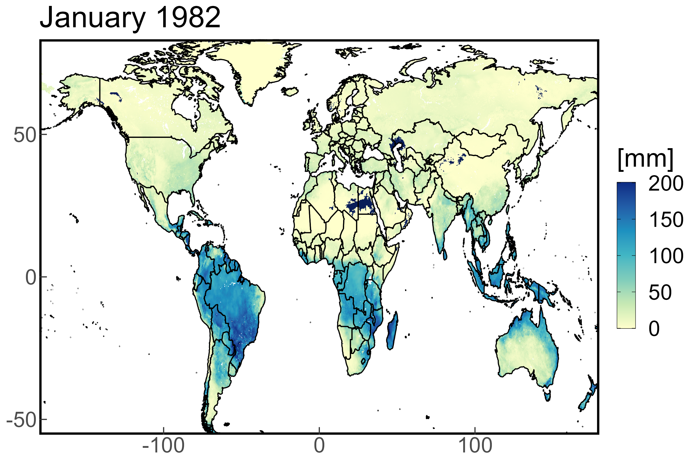
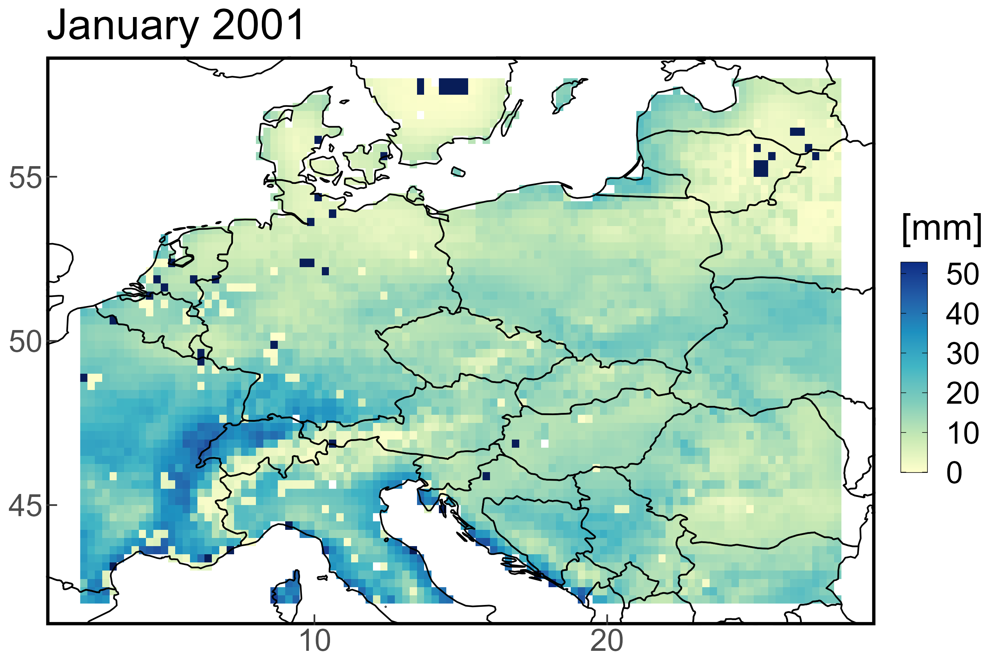

```{=html}
<style>
body {
text-align: justify}
</style>
```

------------------------------------------------------------------------

```{r start, include = FALSE}
knitr::opts_chunk$set(
  echo = TRUE,
  eval = TRUE,
  fig.width = 7,
  warning = FALSE,
  message = FALSE
)
library(evapoRe)
library(kableExtra)

data('fldas_global_ts')
data('fldas_subset_ts')
data('fldas_cz_ts')
```

The `evapoRe` package is a complementary tool to the `pRecipe` package,
developed as part of the ITHACA project at the Faculty of Environmental
Sciences, Czech University of Life Sciences Prague, Czechia. Its primary
purpose is to facilitate the download, exploration, visualization, and
analysis of evapotranspiration (ET) data. Additionally, evapoRe offers
the functionality to calculate various potential evapotranspiration
(PET) methods.

<br> \~*The Global Water Cycle Budget* \| @vargas_godoy_global_2021

*"Like civilization and technology, our understanding of the global
water cycle has been continuously evolving, and we have adapted our
quantification methods to better exploit new technological resources.
The accurate quantification of global water fluxes and storage is
crucial in studying the global water cycle."*

------------------------------------------------------------------------

## Before We Start

Like many other R packages, `evapoRe` has some system requirements:

-   [PROJ](https://proj.org/download.html)
-   Geospatial Data Abstraction Library
    [(GDAL)](https://gdal.org/download.html)
-   Network Common Data Form
    [(NetCDF)](https://www.unidata.ucar.edu/software/netcdf/)

## Data

`evapoRe` database hosts 10 different ET data sets; one satellite-based,
four reanalysis, and five hydrological model products. Their native
specifications, as well as links to their providers, and their
respective references are detailed in the following subsections. We have
already homogenized, compacted to a single file, and stored them in a
[Zenodo repository](https://doi.org/10.5281/zenodo.7990413) under the
following naming convention:

`<data set>_<variable>_<units>_<coverage>_<start date>_<end date>_<resolution>_<time step>.nc`

The `evapoRe` data collection was homogenized to these specifications:
\* `<variable>` = Actual evapotranspiration (e) \* `<units>` =
millimeters (mm) \* `<resolution>` = 0.25° \* `<time step>` = monthly

E.g., ERA5 [@hersbach_era5_2020] would be:

`era5_e_mm_global_195901_202112_025_monthly.nc`

### Satellite-Based Products

```{r satellite, echo=FALSE, results = 'asis'}
tibble::tribble(
  ~"Data Set", ~"Spatial Resolution", ~Global, ~Land, ~Ocean, ~"Temporal Resolution", ~"Record Length", ~"Get Data", ~Reference, 
"GLEAM V3.0", "0.25°", "", "x", "", "Monthly", "1980/01-2021/12", "[Download](https://www.gleam.eu/)", "@martens_gleam_2017"
) |>
  kbl(align = 'lcccccccr') |>
  kable_styling("striped") |>
  add_header_above(c(" " = 1, " " = 1, "Spatial Coverage" = 3, " " = 1, " " = 1, " " = 1, " " = 1)) |>
  unclass() |> cat()
```

### Reanalysis Products

```{r reanalysis, echo=FALSE, echo=FALSE, results = 'asis'}
tibble::tribble(
  ~"Data Set", ~"Spatial Resolution", ~Global, ~Land, ~Ocean, ~"Temporal Resolution", ~"Record Length", ~"Get Data", ~Reference,
"ERA5-Land", "0.1°", "", "x", "", "Monthly", "1960/01-2022/12", "[Download](https://cds.climate.copernicus.eu/cdsapp#!/dataset/reanalysis-era5-land-monthly-means?tab=form)", "@munoz-sabater_era5-land_2021",
"ERA5", "0.25°", "x", "x", "x", "Monthly", "1959/01-2021/12", "[Download](https://cds.climate.copernicus.eu/cdsapp#!/dataset/reanalysis-era5-single-levels-monthly-means?tab=overview)", "@hersbach_era5_2020",
"JRA-55", "1.25°", "", "x", "", "Monthly", "1958/01-2021/12", "[Download](https://rda.ucar.edu/datasets/ds628.1/dataaccess/)", "@kobayashi_jra-55_2015",
"MERRA-2", "0.5° x 0.625°", "", "x", "", "Monthly", "1980/01-2023/01", "[Download](https://disc.gsfc.nasa.gov/datasets?page=1&project=MERRA-2)", "@gelaro_modern-era_2017"
) |>
  kbl(align = 'lcccccccr') |>
  kable_styling("striped") |>
  add_header_above(c(" " = 1, " " = 1, "Spatial Coverage" = 3, " " = 1, " " = 1, " " = 1, " " = 1)) |>
  unclass() |> cat()
```

### Hydrological Model Forcing

```{r models, echo=FALSE, results = 'asis'}
tibble::tribble(
  ~"Data Set", ~"Spatial Resolution", ~Global, ~Land, ~Ocean, ~"Temporal Resolution", ~"Record Length", ~"Get Data", ~Reference,
"FLDAS", "0.1°", "", "x", "", "Monthly", "1982/01-2022/12", "[Download](https://ldas.gsfc.nasa.gov/fldas/fldas-data-download)", "@mcnally_land_2017",
"GLDAS CLSM V2.1", "1°", "", "x", "", "Monthly", "2000/01-2022/11", "[Download](https://ldas.gsfc.nasa.gov/gldas/gldas-get-data)", "@rodell_global_2004",
"GLDAS NOAH V2.1", "0.25°", "", "x", "", "Monthly", "2000/01-2022/11", "[Download](https://ldas.gsfc.nasa.gov/gldas/gldas-get-data)", "@rodell_global_2004 and @beaudoing_gldas_2020",
"GLDAS VIC V2.1", "1°", "", "x", "", "Monthly", "2000/01-2022/11", "[Download](https://ldas.gsfc.nasa.gov/gldas/gldas-get-data)", "@rodell_global_2004",
"TerraClimate", "4$km$", "", "x", "", "Monthly", "1958/01-2021/12", "[Download](https://www.climatologylab.org/terraclimate.html)", "@abatzoglou_terraclimate_2018"
) |>
  kbl(align = 'lcccccccr') |>
  kable_styling("striped") |>
  add_header_above(c(" " = 1, " " = 1, "Spatial Coverage" = 3, " " = 1, " " = 1, " " = 1, " " = 1)) |>
  unclass() |> cat()
```

# Recipe

In this introductory recipe we will first download the FLDAS data set.
We will then subset the downloaded data over Central Europe for the
2001-2010 period, and crop it to the national scale for Czechia. In the
next step, we will generate time series for our data sets and conclude
with the visualization of our data.

**NOTE:** While the functions in `evapoRe` are intended to work directly
with its data inventory. It can handle most other ET data sets in ".nc"
format, as well as any other ".nc" file generated by its functions.

## Installation

```{r install, eval = FALSE}
devtools::install_github("AkbarR1184/evapoRe")
library(evapoRe)
```

## Download

Downloading the entire data collection or only a few data sets is quite
straightforward. You just call the `download_data` function, which has
four arguments *name*, *destination*, *domain*, and *time_res*.

-   *name* is set to "all" by default, but you can specify the names of
    your data sets of interest only.
-   *destination* is set to "." by default. I.e., the current working
    directory. By replacing it for [your_project_folder], the downloaded
    files will be stored in [your_project_folder] instead.
-   *domain* is set to "raw" by default, but you can specify the domain
    of your interest only. E.g., "ocean" for ocean only data sets (For
    availability please check the [Data] section).
-   *time_res* is set to "monthly" by default, but if you prefer you can
    also download annual data with "yearly".

Let's download the fldas data set and inspect its content with
`show_info`:

```{r download, eval = FALSE}
download_data(name = 'fldas')
fldas_global <- raster::brick('fldas_e_mm_land_198201_202212_025_monthly.nc')
show_info(fldas_global)
```

```         
[1] "class      : RasterBrick "                                         
[2] "dimensions : 720, 1440, 1036800, 492  (nrow, ncol, ncell, nlayers)"
[3] "resolution : 0.25, 0.25  (x, y)"
[4] "extent     : -180, 180, -90, 90  (xmin, xmax, ymin, ymax)"
[5] "crs        : +proj=longlat +datum=WGS84 "
[6] "source     : fldas_e_mm_land_198201_202212_025_monthly.nc "
[7] "names      : X1982.01.01, X1982.02.01, X1982.03.01, X1982.04.01, X1982.05.01, X1982.06.01, X1982.07.01, X1982.08.01, X1982.09.01, X1982.10.01, X1982.11.01, X1982.12.01, X1983.01.01, X1983.02.01, X1983.03.01, ... "
[8] "Date/time  : 1982-01-01, 2022-12-01 (min, max)"
[9] "varname    : e " 
```

## Processing

Once we have downloaded our database, we can start processing the data
with:

-   `subset_spacetime` to subset the data in time and space.
-   `subset_space` to subset the data to the region of interest.
-   `subset_time` to select the years of interest.
-   `mon_to_year` to aggregate the data from monthly into annual.
-   `rescale_data` to go from the native resolution (0.25°) to coarser
    ones (e.g., 0.5°, 1°, 1.5°, 2°, etc).
-   `make_ts` to generate a time series by taking the area weighted
    average over each time step.

### Subset

To subset our data to a desired region and period of interest, we use
the `subset_spacetime` function, which has four arguments *data*,
*years*, *bbox*, and *autosave*.

-   *data* is the path to the data set of interest or a RasterBrick
    object.
-   *years* is the period of interest in the form (start_year, end_year)
-   *bbox* is the bounding box of the region of interest with the
    coordinates in degrees in the form (xmin, xmax, ymin, ymax).
-   *autosave* is set to FALSE by default. If TRUE data will be
    automatically stored in the same location of the input file.

Let's subset the fldas data set over Central Europe (2,28,42,58) for the
1981-2020 period, and inspect its content with `show_info`:

```{r subset, eval = FALSE}
fldas_subset <- subset_spacetime(fldas_global, years = c(2001, 2010), bbox = c(2,28,42,58))
show_info(fldas_subset)
```

```         
[1] "class      : RasterBrick "
[2] "dimensions : 64, 104, 6656, 120  (nrow, ncol, ncell, nlayers)"
[3] "resolution : 0.25, 0.25  (x, y)"
[4] "extent     : 2, 28, 42, 58  (xmin, xmax, ymin, ymax)"
[5] "crs        : +proj=longlat +datum=WGS84 "
[6] "source     : memory"
[7] "names      :  X2001.01.01,  X2001.02.01,  X2001.03.01,  X2001.04.01,  X2001.05.01,  X2001.06.01,  X2001.07.01,  X2001.08.01,  X2001.09.01,  X2001.10.01,  X2001.11.01,  X2001.12.01,  X2002.01.01,  X2002.02.01,  X2002.03.01, ... "
[8] "min values : -3.7794194221, -0.4208407104, -0.5045991540, -0.0572454371, -0.0005709816,  0.0000000000,  0.0000000000,  0.0000000000, -0.3487000465, -1.6532191038, -0.4017279446, -2.5777058601, -2.6171388626, -0.3143836856, -0.2774783075, ... "
[9] "max values :      56.90099,      69.52248,     113.14240,     125.60358,     174.75136,     190.40407,     189.30975,     155.39180,      99.69257,      76.16212,      62.63054,      47.89834,      40.91222,      68.70403,      99.67541, ... "
[10] "time       : 2001-01-01, 2010-12-01 (min, max)"
```

### Crop

To further crop our data to a desired polygon other than a rectangle, we
use the `crop_data` function, which has three arguments *x*, *shp_path*,
*autosave*.

-   *x* is the path to a ".nc" data set file or a RasterBrick object.
-   *shp_path* is the path to a ".shp" file that we want to use to crop
    our data.
-   *autosave* is set to FALSE by default. If TRUE data will be
    automatically stored in the same location of the input file.

Let's crop our fldas subset to cover only Czechia with the respective
[shape
file](https://geodata.ucdavis.edu/gadm/gadm4.1/shp/gadm41_CZE_shp.zip),
and inspect its content with `show_info`:

```{r crop, eval = FALSE}
fldas_cz <- crop_data(x = fldas_cz, shp_path = "gadm41_CZE_0.shp")
show_info(fldas_cz)
```

```         
[1] "class      : RasterBrick "
[2] "dimensions : 64, 104, 6656, 120  (nrow, ncol, ncell, nlayers)"
[3] "resolution : 0.25, 0.25  (x, y)"
[4] "extent     : 2, 28, 42, 58  (xmin, xmax, ymin, ymax)"
[5] "crs        : +proj=longlat +datum=WGS84 "
[6] "source     : memory"
[7] "names      : X2001.01.01, X2001.02.01, X2001.03.01, X2001.04.01, X2001.05.01, X2001.06.01, X2001.07.01, X2001.08.01, X2001.09.01, X2001.10.01, X2001.11.01, X2001.12.01, X2002.01.01, X2002.02.01, X2002.03.01, ... "
[8] "min values :   2.8995819,   0.3797975,   3.0552430,   2.6468999,   2.3843012,   8.8729420,  10.6661291,   6.5048337,   3.1765358,   1.2650596,   2.0705938,   4.3670325,   8.1393061,   2.2920027,   1.8019267, ... "
[9] "max values :    19.11826,    33.55016,    46.44899,    67.51703,   154.64659,   127.61076,   148.00507,   130.79279,    60.39583,    39.82825,    25.54001,    22.27194,    30.96886,    35.84626,    53.87944, ... "
[10] "time       : 2001-01-01, 2010-12-01 (min, max)"
```

### PET calculation

First we need to download temperature data. To to this we will use
terraclimate temperature data from the [Zenodo
repository](https://doi.org/10.5281/zenodo.7990413):

*variable* is the variable name in which `t` stands for tavg, tmin, and
tmax.

```{r download_terraclimate, eval=FALSE}
download_terraclimate(variable = "t", folder_path = ".")
```

This will returns terraclimate temperature data in following name
convention e.g.,

`terraclimate_tavg_land_19580101_20221231_025_monthly.nc`

`pet_calc` function is calculating PET from various PET *method*. "hs"
for Hargreaves Samani method [@hargreaves1982estimating], "od" for Oudin
method [@oudin2005potential], "mb" for McGuinness and Bordne method
[@mcguinness1972comparison], "jh" for Jensen Haise method
[@jensen1963estimating], and "br" for Baier and Robertson
[@baier1965estimation].

#### Calculate PET by Oudin method

```{r pet_calc, eval=FALSE}
tavg_brick <- raster::brick("terraclimate_tavg_land_19580101_20221231_025_monthly.nc")
pet_Oudin<- pet_calc(method = "od", tavg = tavg_brick)
show_info(pet_Oudin)
```

### Generate Time series

To make a time series out of our data, we use the `make_ts` function,
which has two arguments *data*, and *autosave*.

-   *data* is the path to a ".nc" data set file or a RasterBrick object.
-   *autosave* is set to FALSE by default. If TRUE data will be
    automatically stored in the same location of the input file.

Let's generate the time series for our three different fldas data sets
(Global, Central Europe, and Czechia), and inspect its first 12 rows:

```{r global_ts, eval=FALSE}
fldas_global_ts <- make_ts(fldas_global)
head(fldas_global_ts, 12)
```

```         
          date    value name type
 1: 1982-01-01 40.01818   NA   NA
 2: 1982-02-01 39.05691   NA   NA
 3: 1982-03-01 45.63258   NA   NA
 4: 1982-04-01 48.38817   NA   NA
 5: 1982-05-01 56.04541   NA   NA
 6: 1982-06-01 59.48527   NA   NA
 7: 1982-07-01 63.42378   NA   NA
 8: 1982-08-01 58.08678   NA   NA
 9: 1982-09-01 47.53051   NA   NA
10: 1982-10-01 43.30959   NA   NA
11: 1982-11-01 39.14826   NA   NA
12: 1982-12-01 39.41859   NA   NA
```

```{r subset_ts, eval=FALSE}
fldas_subset_ts <- make_ts(fldas_subset)
head(fldas_subset_ts, 12)
```

```         
          date     value name type
 1: 2001-01-01  14.47523   NA   NA
 2: 2001-02-01  24.55700   NA   NA
 3: 2001-03-01  43.77176   NA   NA
 4: 2001-04-01  61.23033   NA   NA
 5: 2001-05-01 112.55881   NA   NA
 6: 2001-06-01 114.57058   NA   NA
 7: 2001-07-01 116.47619   NA   NA
 8: 2001-08-01  79.83941   NA   NA
 9: 2001-09-01  50.78079   NA   NA
10: 2001-10-01  32.62168   NA   NA
11: 2001-11-01  20.41700   NA   NA
12: 2001-12-01  13.59456   NA   NA
```

```{r cz_ts, eval=FALSE}
fldas_cz_ts <- make_ts(fldas_cz)
head(fldas_cz_ts, 12)
```

```         
          date     value name type
 1: 2001-01-01  12.23963   NA   NA
 2: 2001-02-01  23.80942   NA   NA
 3: 2001-03-01  36.08155   NA   NA
 4: 2001-04-01  50.36031   NA   NA
 5: 2001-05-01 105.76477   NA   NA
 6: 2001-06-01  95.73339   NA   NA
 7: 2001-07-01  99.95880   NA   NA
 8: 2001-08-01  80.05314   NA   NA
 9: 2001-09-01  42.28572   NA   NA
10: 2001-10-01  24.04546   NA   NA
11: 2001-11-01  15.01222   NA   NA
12: 2001-12-01  12.39291   NA   NA
```

## Visualize

Either after we have processed our data as required or right after
downloaded, we have six different options to visualize our data for more
information refer to [visualisation section of
pRecipe](https://cran.r-project.org/web/packages/pRecipe/vignettes/pRecipe.html#visualize):

### Maps

To see a map of any data set raw or processed, we use `plot_map` which
takes only one layer of the RasterBrick as input.

```{r map_global, eval = FALSE}
plot_map(fldas_global[[1]])
```

{width="90%"}

```{r map_subset, eval = FALSE}
plot_map(fldas_subset[[1]])
```

{width="90%"}

```{r map_cz, eval = FALSE}
plot_map(fldas_cz[[1]])
```

{width="90%"}

### Time Series Visuals

To draw a time series generated by `make_ts`, we use any of the options
below, which takes only a `make_ts` ".csv" generated file.

#### Lineplots

```{r, eval = FALSE}
plot_line(fldas_global_ts)
plot_line(fldas_subset_ts)
plot_line(fldas_cz_ts)
```

#### Heatmap

```{r}
plot_heatmap(fldas_global_ts)
plot_heatmap(fldas_subset_ts)
plot_heatmap(fldas_cz_ts)
```

#### Boxplot

```{r}
plot_box(fldas_global_ts)
plot_box(fldas_subset_ts)
plot_box(fldas_cz_ts)
```

#### Density plots

```{r}
plot_density(fldas_global_ts)
plot_density(fldas_subset_ts)
plot_density(fldas_cz_ts)
```

#### Summary

**NOTE:** For good aesthetics we recommend saving `plot_summary` with
`ggsave(<filename>, <plot>, width = 16.3, height = 15.03)`.

```{r, eval=FALSE}
plot_summary(fldas_global_ts)
#plot_summary(fldas_subset_ts)
#plot_summary(fldas_cz_ts)
```

{width="95%"}

# Coming Soon

We will introduce significant enhancements to ET database and PET
calculation methods. This expansion builds upon our existing
temperature-based approach and incorporates a radiation-based PET
calculation methods, along with an expanded range of temperature-based
methods. Our aim is to provide users with a more comprehensive and
accurate estimation of ET and PET, catering to a broader range of
applications and requirements.

# References
