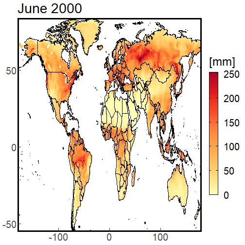
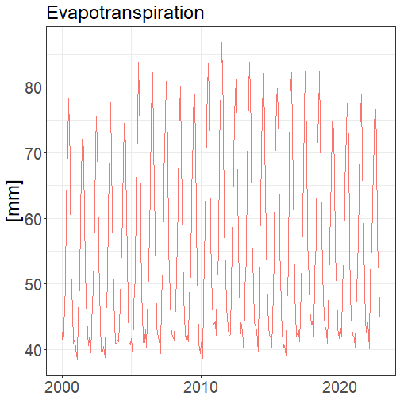
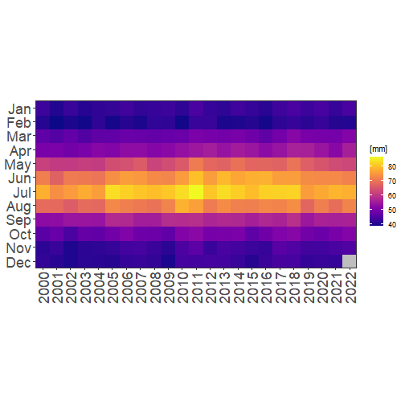
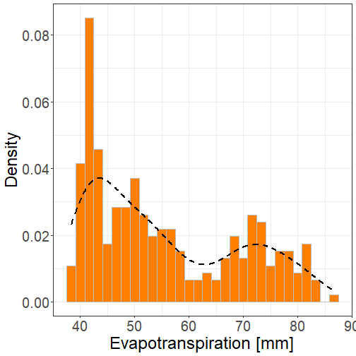
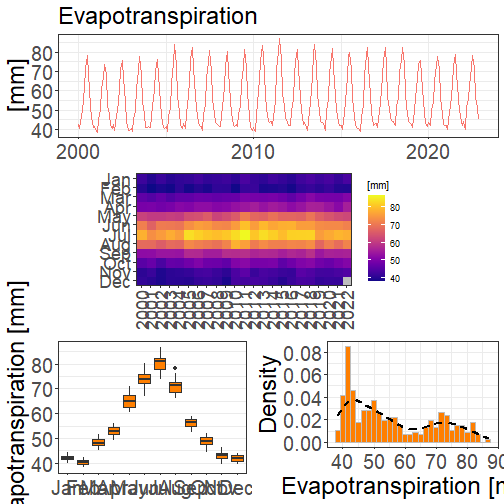

<style>
body {
text-align: justify}
</style>


# evapoRe Package

This vignette provides an overview of the functions available in the `evapoRe` package, along with examples of their usage and data visualization.

## Installation

To install the `evapoRe` package, you can use the `devtools` package:


```r
devtools::install_github("AkbarR1184/evapoRe")
```

## Load the Package

Once installed, you can load the `evapoRe` package into your R session:


```r
library(evapoRe)
```

## Download Data

To begin working with the `evapoRe` package, you can download the required data using the `download_data()` function. For example, to download the GLDAS CLSM dataset, you can use the following command:


```r
download_data(name = 'gldas-clsm')
```

## Data Exploration

After downloading the data, you can explore its information using the `show_info()` function. The following code demonstrates how to display information about the global GLDAS CLSM dataset:


```r
gldas_clsm_global <- raster::brick('gldas-clsm_e_mm_land_200001_202211_025_monthly.nc')
show_info(gldas_clsm_global)
```

```
## [1] "class      : RasterBrick "                                                                                                                                                                                           
## [2] "dimensions : 720, 1440, 1036800, 275  (nrow, ncol, ncell, nlayers)"                                                                                                                                                  
## [3] "resolution : 0.25, 0.25  (x, y)"                                                                                                                                                                                     
## [4] "extent     : -180, 180, -90, 90  (xmin, xmax, ymin, ymax)"                                                                                                                                                           
## [5] "crs        : +proj=longlat +datum=WGS84 +no_defs "                                                                                                                                                                   
## [6] "source     : gldas-clsm_e_mm_land_200001_202211_025_monthly.nc "                                                                                                                                                     
## [7] "names      : X2000.01.01, X2000.02.01, X2000.03.01, X2000.04.01, X2000.05.01, X2000.06.01, X2000.07.01, X2000.08.01, X2000.09.01, X2000.10.01, X2000.11.01, X2000.12.01, X2001.01.01, X2001.02.01, X2001.03.01, ... "
## [8] "Date       : 2000-01-01, 2022-11-01 (min, max)"                                                                                                                                                                      
## [9] "varname    : e "
```

## Data Subsetting

To subset the downloaded data based on specific criteria, you can use the `subset_spacetime()` function. The example below shows how to subset the GLDAS CLSM dataset for the years 2001-2010 and within a bounding box:


```r
gldas_clsm_subset <- subset_spacetime(gldas_clsm_global, years = c(2001, 2010), bbox = c(2,28,42,58))
show_info(gldas_clsm_subset)
```

```
##  [1] "class      : RasterBrick "                                                                                                                                                                                                          
##  [2] "dimensions : 64, 104, 6656, 120  (nrow, ncol, ncell, nlayers)"                                                                                                                                                                      
##  [3] "resolution : 0.25, 0.25  (x, y)"                                                                                                                                                                                                    
##  [4] "extent     : 2, 28, 42, 58  (xmin, xmax, ymin, ymax)"                                                                                                                                                                               
##  [5] "crs        : +proj=longlat +datum=WGS84 +no_defs "                                                                                                                                                                                  
##  [6] "source     : memory"                                                                                                                                                                                                                
##  [7] "names      :  X2001.01.01,  X2001.02.01,  X2001.03.01,  X2001.04.01,  X2001.05.01,  X2001.06.01,  X2001.07.01,  X2001.08.01,  X2001.09.01,  X2001.10.01,  X2001.11.01,  X2001.12.01,  X2002.01.01,  X2002.02.01,  X2002.03.01, ... "
##  [8] "min values :  -6.52199984,   2.92202687,   7.34032774,  21.86954689,  22.72333336,  40.87482834,  42.34235001,  48.86763763,  26.36499977,   9.97645855,   2.74581981,  -2.55925989, -13.23385811,  -5.90377951,  14.25008392, ... "
##  [9] "max values :     39.34776,     59.50647,     71.14590,    111.53451,    170.21600,    187.99019,    192.55907,    190.69772,     92.26154,     70.78891,     55.01104,     50.32963,     50.21034,     67.48029,     76.13699, ... "
## [10] "time       : 2001-01-01, 2010-12-01 (min, max)"
```

## Data Cropping

To crop the data to a specific spatial extent, you can utilize the `crop_data()` function. The code snippet below demonstrates how to crop the subsetted GLDAS CLSM data to a specific shapefile:


```r
gldas_clsm_cz <- crop_data(x = gldas_clsm_subset, shp_path = "gadm41_CZE_0.shp")
show_info(gldas_clsm_cz)
```

```
##  [1] "class      : RasterBrick "                                                                                                                                                                                           
##  [2] "dimensions : 64, 104, 6656, 120  (nrow, ncol, ncell, nlayers)"                                                                                                                                                       
##  [3] "resolution : 0.25, 0.25  (x, y)"                                                                                                                                                                                     
##  [4] "extent     : 2, 28, 42, 58  (xmin, xmax, ymin, ymax)"                                                                                                                                                                
##  [5] "crs        : +proj=longlat +datum=WGS84 +no_defs "                                                                                                                                                                   
##  [6] "source     : memory"                                                                                                                                                                                                 
##  [7] "names      : X2001.01.01, X2001.02.01, X2001.03.01, X2001.04.01, X2001.05.01, X2001.06.01, X2001.07.01, X2001.08.01, X2001.09.01, X2001.10.01, X2001.11.01, X2001.12.01, X2002.01.01, X2002.02.01, X2002.03.01, ... "
##  [8] "min values :   0.4483199,   9.5629463,  13.3858862,  41.2026558, 100.3955154,  72.9504623,  90.1328659,  95.8753586,  28.9377785,  23.5860615,   2.7458198,   1.5310012,  -7.8326845,  13.8018255,  37.3040085, ... "
##  [9] "max values :    5.531880,   15.336628,   34.385384,   69.114105,  138.656677,  106.782722,  129.662613,  127.534012,   39.665840,   39.544163,   14.476708,    7.447963,    5.591727,   24.932419,   51.806755, ... "
## [10] "time       : 2001-01-01, 2010-12-01 (min, max)"
```

## Time Series Creation

To convert the data into time series format, you can use the `make_ts()` function. Here's an example of creating time series for the global GLDAS CLSM dataset:


```r
gldas_clsm_global_ts <- make_ts(gldas_clsm_global)
head(gldas_clsm_global_ts, 12)
```

```
##           date    value name type
##  1: 2000-01-01 42.63418   NA   NA
##  2: 2000-02-01 40.28064   NA   NA
##  3: 2000-03-01 46.65724   NA   NA
##  4: 2000-04-01 49.73078   NA   NA
##  5: 2000-05-01 61.78450   NA   NA
##  6: 2000-06-01 71.51643   NA   NA
##  7: 2000-07-01 78.34947   NA   NA
##  8: 2000-08-01 68.59857   NA   NA
##  9: 2000-09-01 52.40877   NA   NA
## 10: 2000-10-01 45.95624   NA   NA
## 11: 2000-11-01 40.95821   NA   NA
## 12: 2000-12-01 41.50710   NA   NA
```

## Data Visualization


The `evapoRe` package provides several functions for visualizing the data. Here are some examples:

### Map Visualization

You can use the `plot_map()` function to visualize spatial data on a map. The following code demonstrates how to plot the first layer of the global GLDAS CLSM dataset:


```r
plot_map(gldas_clsm_global[[6]])
```



Similarly, you can plot the first layer of the subsetted and cropped datasets using `plot_map(gldas_clsm_subset[[6]])` and `plot_map(gldas_clsm_cz[[6]])`, respectively.

### Time Series Visualization

To visualize the data as time series, you can utilize the `plot_line()` function. Here's an example of plotting the time series for the global GLDAS CLSM dataset:


```r
plot_line(gldas_clsm_global_ts)
```



Similarly, you can plot the time series for the subsetted and cropped datasets using `plot_line(gldas_clsm_subset_ts)` and `plot_line(gldas_clsm_cz_ts)`, respectively.

### Heatmap Visualization

The `plot_heatmap()` function allows you to create heatmaps of the data. Here's an example of plotting a heatmap for the global GLDAS CLSM dataset:


```r
plot_heatmap(gldas_clsm_global_ts)
```



You can also create heatmaps for the subsetted and cropped datasets using `plot_heatmap(gldas_clsm_subset_ts)` and `plot_heatmap(gldas_clsm_cz_ts)`, respectively.

### Boxplot Visualization

To visualize the distribution of the data using boxplots, you can use the `plot_box()` function. Here's an example of plotting boxplots for the global GLDAS CLSM dataset:


```r
plot_box(gldas_clsm_global_ts)
```


Similarly, you can plot boxplots for the subsetted and cropped datasets using `plot_box(gldas_clsm_subset_ts)` and `plot_box(gldas_clsm_cz_ts)`, respectively.

### Density Plot Visualization

The `plot_density()` function allows you to create density plots of the data. Here's an example of plotting a density plot for the global GLDAS CLSM dataset:


```r
plot_density(gldas_clsm_global_ts)
```



You can also create density plots for the subsetted and cropped datasets using `plot_density(gldas_clsm_subset_ts)` and `plot_density(gldas_clsm_cz_ts)`, respectively.

### Summary Plot Visualization

The `plot_summary()` function provides a summary plot of the data. Please note that for good aesthetics, it is recommended to save the `plot_summary()` output using `ggsave()` with specified width and height. Here's an example:


```r
plot_summary(gldas_clsm_global_ts) # NOTE: For good aesthetics, we recommend saving plot_summary with ggsave(<filename>, <plot>, width = 16.3, height = 15.03).
```



This covers the visualization capabilities of the `evapoRe` package. You can further explore these functions and their parameters in the package documentation for more customization options.

---

This concludes the vignette on the `evapoRe` package. For more detailed usage instructions and additional functions, please refer to the package documentation.
